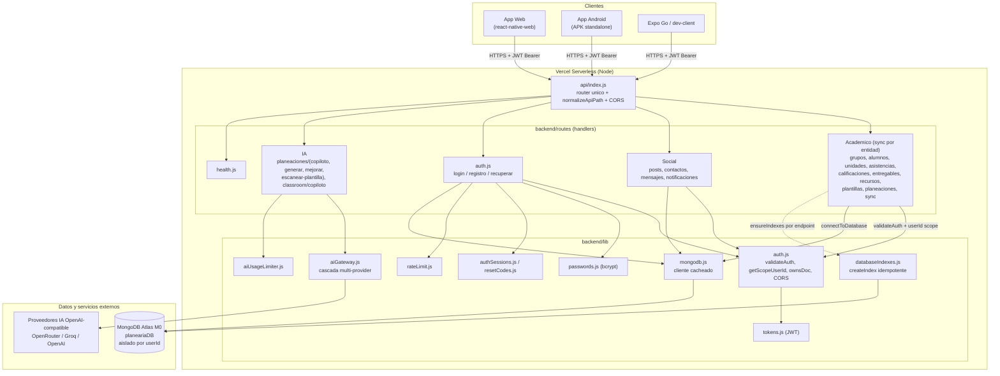
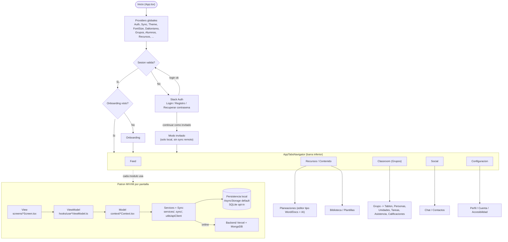
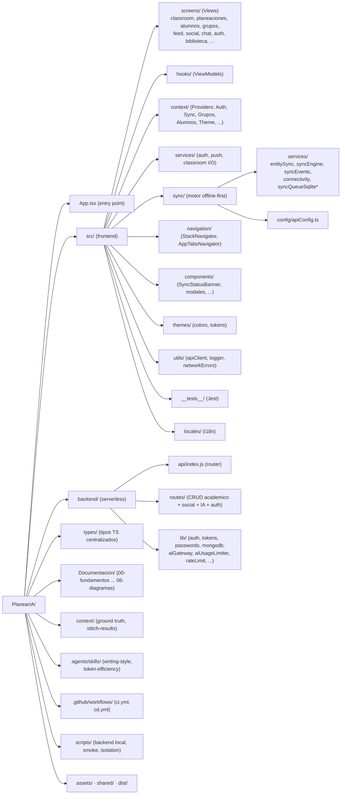
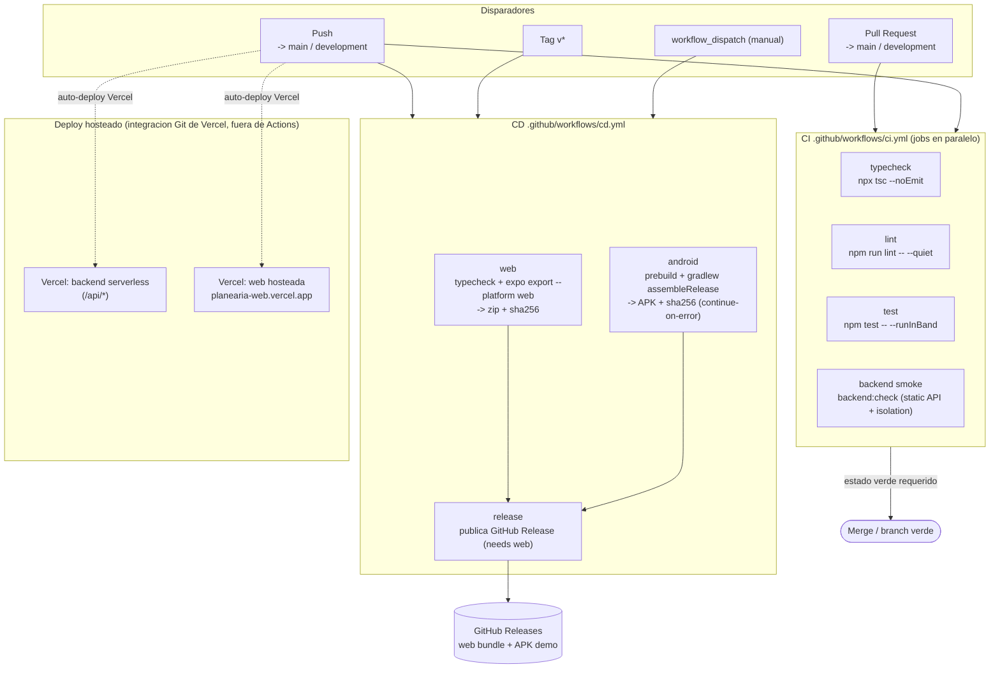
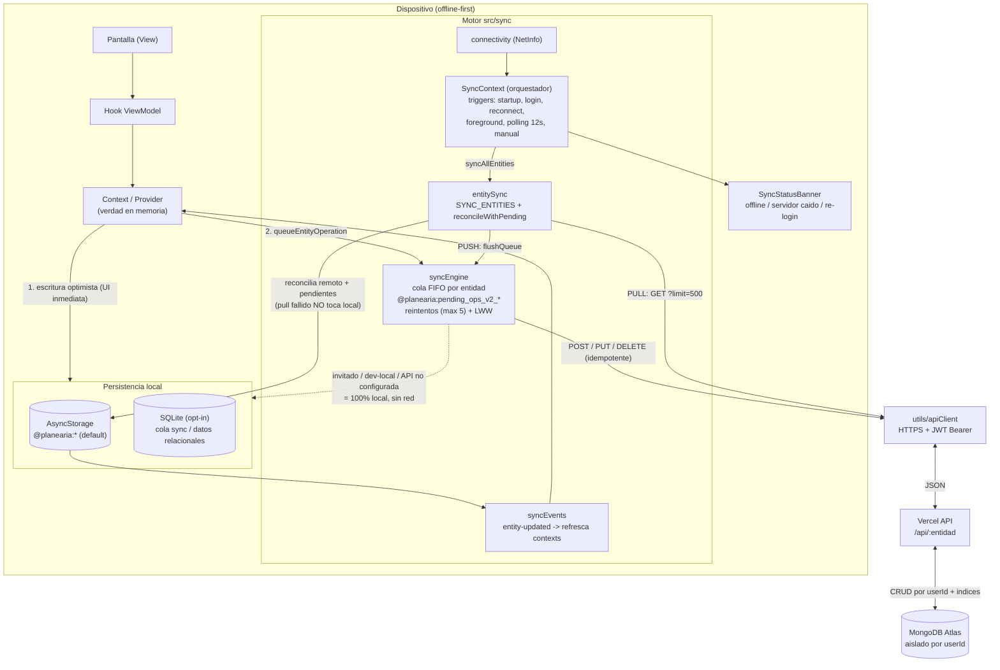

# Diagramas de Arquitectura - PlanearIA

Diagramas tecnicos en Mermaid generados a partir del codigo real del repositorio
(backend, `src/sync`, `.github/workflows`, navegacion y estructura de carpetas).

Cada diagrama tiene su archivo fuente `.mmd` y esta embebido aqui. GitHub y VS Code
renderizan los bloques ` ```mermaid ` automaticamente.

## Indice

1. [Arquitectura del Backend](#1-arquitectura-del-backend) - `01-arquitectura-backend.mmd`
2. [App: flujo de usuario y capas MVVM](#2-app-flujo-de-usuario-y-capas-mvvm) - `02-app-flujo-usuario.mmd`
3. [App: estructura de carpetas](#3-app-estructura-de-carpetas) - `03-app-estructura-carpetas.mmd`
4. [Flujo CI/CD](#4-flujo-cicd) - `04-ci-cd.mmd`
5. [Sincronizacion offline-first](#5-sincronizacion-offline-first) - `05-sincronizacion-offline-first.mmd`

## Como verlos o exportarlos a imagen

Las imagenes ya estan pre-renderizadas en `img/` (SVG vectorial y PNG @2x). No hace falta
ejecutar nada para verlas; abre los archivos de esa carpeta. Para regenerarlas tras editar un
`.mmd`, usa los comandos de mermaid-cli mas abajo.

- GitHub: abre este `README.md` en el repo; los diagramas se renderizan solos.
- VS Code: instala la extension "Markdown Preview Mermaid Support" y abre la vista previa
  (Ctrl+Shift+V), o "Mermaid Editor" para los `.mmd`.
- Web sin instalar nada: pega el contenido de un `.mmd` en https://mermaid.live y exporta a PNG/SVG.
- Generar imagenes localmente (vectoriales y nitidas) con mermaid-cli:

  ```bash
  # desde Documentacion/06-diagramas
  npx -y @mermaid-js/mermaid-cli -i 01-arquitectura-backend.mmd -o img/01-arquitectura-backend.svg
  npx -y @mermaid-js/mermaid-cli -i 02-app-flujo-usuario.mmd -o img/02-app-flujo-usuario.svg
  npx -y @mermaid-js/mermaid-cli -i 03-app-estructura-carpetas.mmd -o img/03-app-estructura-carpetas.svg
  npx -y @mermaid-js/mermaid-cli -i 04-ci-cd.mmd -o img/04-ci-cd.svg
  npx -y @mermaid-js/mermaid-cli -i 05-sincronizacion-offline-first.mmd -o img/05-sincronizacion-offline-first.svg
  ```

  Cambia la extension de salida a `.png` para PNG. La primera ejecucion descarga Chromium
  (lo usa puppeteer); requiere conexion a internet.

---

## 1. Arquitectura del Backend

Node serverless en Vercel con router unico (`backend/api/index.js`) que despacha a los
handlers de `backend/routes`. Toda ruta academica valida JWT y aisla por `userId`, crea sus
indices de forma idempotente y reutiliza la conexion cacheada a MongoDB Atlas. La IA pasa por
un gateway multi-provider; las API keys viven solo en el backend.



---

## 2. App: flujo de usuario y capas MVVM

Arranque de la app, decision de sesion (login / registro / invitado), onboarding y entrada a
los tabs. Cada modulo respeta el patron MVVM: View (pantalla) -> ViewModel (hook) ->
Model (context) -> Services/Sync -> persistencia local y backend.



---

## 3. App: estructura de carpetas

Mapa del repositorio: entry point, frontend `src/`, backend serverless, tipos, documentacion,
ground truth, skills y workflows.



---

## 4. Flujo CI/CD

`ci.yml` corre en PR y push a `main`/`development` (typecheck, lint, jest, backend smoke).
`cd.yml` construye web y APK Android y publica un GitHub Release. El backend y la web hosteada
se despliegan en Vercel mediante su integracion Git (fuera de Actions).



---

## 5. Sincronizacion offline-first

Como fluyen los datos: escritura optimista local primero, cola por entidad en el motor
`src/sync`, push y luego pull autoritativo desde MongoDB Atlas via la API de Vercel, con
reconciliacion contra operaciones pendientes. Un pull fallido nunca toca el storage local.

### 5a. Vista de arquitectura



### 5b. Secuencia: escribir offline y sincronizar al reconectar

```mermaid
sequenceDiagram
    actor U as Usuario
    participant V as Pantalla + ViewModel
    participant C as Context
    participant L as AsyncStorage (local)
    participant Q as syncEngine (cola)
    participant O as SyncContext (orquestador)
    participant A as Vercel API
    participant M as MongoDB Atlas

    Note over U,L: Sin conexion
    U->>V: Crea / edita / borra
    V->>C: accion del ViewModel
    C->>L: escritura optimista (UI ya actualizada)
    C->>Q: queueEntityOperation (encola)
    Q-->>C: pendiente (sin red, sin penalizar reintentos)

    Note over O,M: Vuelve la conexion (reconnect / polling 12s / foreground)
    O->>Q: syncAllEntities -> flushQueue (PUSH)
    Q->>A: POST / PUT / DELETE (idempotente, JWT)
    A->>M: upsert / delete por userId
    M-->>A: ok
    A-->>Q: 2xx -> saca op de la cola

    O->>A: GET /api/:entidad?limit=500 (PULL)
    A->>M: find por userId
    M-->>A: lista autoritativa
    A-->>O: data
    O->>O: reconcileWithPending (conserva trabajo offline)
    O->>L: persiste (solo si hubo cambios)
    O->>C: syncEvents entity-updated -> recarga UI

    Note over O,A: Si el PULL falla (5xx / red): NO toca el storage local; banner y reintento
```

---

## Notas de fidelidad

- Los diagramas reflejan el codigo en `development` al 2026-06-16.
- Fuentes verificadas: `backend/api/index.js`, `backend/routes/*`, `backend/lib/{auth,mongodb,aiGateway}.js`,
  `src/sync/services/{entitySync,syncEngine}.ts`, `src/sync/config/apiConfig.ts`,
  `src/context/SyncContext.tsx`, `.github/workflows/{ci,cd}.yml`, `package.json`.
- Las entidades con sync por registro estan en `SYNC_ENTITIES`; `planeaciones` y `notificaciones`
  usan tareas custom via `registerSyncTask`.
