# Plan Maestro: Refactorización del Módulo de Planeaciones — PlanearIA

> **Versión:** 1.0  
> **Fecha:** 2026-05-27  
> **Alcance:** Rediseño completo del módulo de Planeaciones (tipos, datos, UI, IA, backend, sync)  
> **Stack:** React Native 0.81.5 · Expo 54 · TypeScript 5.9 · MongoDB Atlas · AsyncStorage · MVVM

---

## Análisis del Ground Truth — Planeaciones Reales

> [!IMPORTANT]
> Todas las decisiones de este plan se fundamentan en el análisis de planeaciones reales creadas por docentes mexicanos. Archivos analizados:
>
> - [primero.md](file:///c:/Users/jarco/dev/PlanearIA/context/planeaciones-reales/semana%2033%20y%2034%20primero/primero.md) — 1er grado, Español, 10 sesiones
> - [segundo.md](file:///c:/Users/jarco/dev/PlanearIA/context/planeaciones-reales/semana%2033%20y%2034%20segundo/segundo.md) — 2do grado, Español, 10 sesiones
> - [Matediscretas.md](file:///c:/Users/jarco/dev/PlanearIA/context/planeaciones-reales/MATEDISCRETA/Matediscretas.md) — Matemáticas Discretas I, nivel universidad (transcrito)

### Hallazgos Estructurales Clave

Las planeaciones reales tienen una estructura **radicalmente distinta** al modelo de datos actual del MVP:

| Aspecto                | Modelo Actual (MVP)                                    | Realidad Docente                                                            |
| ---------------------- | ------------------------------------------------------ | --------------------------------------------------------------------------- |
| Sesiones               | 1 sesión con 3 actividades (inicio/desarrollo/cierre) | **10 sesiones** multi-semana, cada una con inicio/desarrollo/cierre/tarea   |
| Evaluación            | Campo string simple                                    | Instrumentos dinámicos (escalas de 3 o 4 puntos, rúbricas con criterios)  |
| Metadata institucional | No existe                                              | Institución, subsistema, ciclo escolar, lugar                              |
| Curriculum NEM         | Parcial                                                | Propósito, PDA, campo formativo, eje articulador, rasgos perfil egreso     |
| Firmas                 | No existe                                              | Coordinadora académica + docente                                           |
| Observaciones          | String simple                                          | Array de notas estructuradas (flexibilidad, USAER, proyectos)               |
| Actividades embebidas  | No existen                                             | Verdadero/falso (☐), preguntas guía numeradas, matching, escritura guiada |
| Cobertura temporal     | 1 fecha                                                | Rango de fechas multi-semana                                                |

---

## Inventario de Código Actual del Módulo

### Archivos Directamente Afectados

```mermaid
graph TD
    subgraph Tipos
        T1["types/planeacion.ts (192 líneas)"]
        T2["types/index.ts — PlaneacionFormData (LEGACY)"]
    end
    subgraph Pantallas
        S1["screens/planeaciones/PlaneacionesScreen.tsx"]
        S2["screens/planeaciones/CrearPlaneacionScreen.tsx"]
        S3["screens/planeaciones/GenerarPlaneacionIAScreen.tsx"]
        S4["screens/planeaciones/ImportarPlaneacionScreen.tsx"]
        S5["screens/planeaciones/ExportarPlaneacionScreen.tsx"]
        S6["screens/planeaciones/EditorPlaneacionScreen.tsx (51KB)"]
        S7["screens/planeaciones/ListaPlaneacionesScreen.tsx"]
    end
    subgraph ViewModels
        V1["hooks/useCrearPlaneacionViewModel.ts"]
        V2["hooks/useEditorPlaneacionViewModel.ts"]
        V3["hooks/useListaPlaneacionesViewModel.ts"]
        V4["hooks/useUniversityDetailMode.ts"]
    end
    subgraph Servicios
        SV1["services/planeacionImportService.ts (330 líneas)"]
        SV2["services/planeacionExportService.ts (262 líneas)"]
    end
    subgraph Sync
        SY1["sync/providers/SyncProvider.tsx (291 líneas)"]
        SY2["sync/services/syncService.ts"]
        SY3["sync/hooks/useSync.ts"]
        SY4["sync/config/apiConfig.ts"]
    end
    subgraph Componentes
        C1["components/EvaluacionEditor.tsx (20KB)"]
        C2["components/SemanaEditor.tsx (22KB)"]
        C3["components/GenerarPlaneacionIAForm.tsx"]
        C4["components/SyncIndicator.tsx"]
    end
    subgraph Backend
        B1["backend/api/planeaciones.js"]
        B2["backend/api/planeaciones/generar.js"]
        B3["backend/api/planeaciones/mejorar.js"]
        B4["backend/api/sync.js"]
    end
    subgraph Navegación
        N1["navigation/StackNavigator.tsx — 7 rutas planeación"]
    end
end
```

### Archivos Indirectamente Afectados

| Archivo                                                                                                      | Razón                                                        |
| ------------------------------------------------------------------------------------------------------------ | ------------------------------------------------------------- |
| [ContenidoScreen.tsx](file:///c:/Users/jarco/dev/PlanearIA/src/screens/contenido/ContenidoScreen.tsx) (59KB) | Tab principal que muestra planeaciones, recursos y plantillas |
| [useContenidoViewModel.ts](file:///c:/Users/jarco/dev/PlanearIA/src/hooks/useContenidoViewModel.ts) (13KB)   | ViewModel del contenido, importa planeaciones                 |
| [App.tsx](file:///c:/Users/jarco/dev/PlanearIA/App.tsx)                                                      | Provider tree (SyncProvider envuelve la app)                  |
| [CrearNuevoModal.tsx](file:///c:/Users/jarco/dev/PlanearIA/src/components/CrearNuevoModal.tsx)               | Modal "crear nuevo" que incluye planeaciones                  |

---

## Decisiones Técnicas

### 1. Editor Tipo "Docs/Word"

> [!IMPORTANT]
> **Decisión: Editor de bloques estructurado con WebView embebida para el canvas de texto enriquecido.**

No existe un componente nativo de React Native que proporcione una experiencia tipo Word/Docs con formato real. Las opciones evaluadas:

| Opción                                  | Veredicto       | Razón                                                                                                  |
| ---------------------------------------- | --------------- | ------------------------------------------------------------------------------------------------------- |
| `TextInput` multiline                    | ❌ Descartado   | Sin formato, sin tablas, sin listas                                                                     |
| `react-native-pell-rich-editor`          | ❌ Descartado   | Abandonado, bugs críticos en Expo                                                                      |
| `@10play/tentap-editor` (Tiptap para RN) | ✅ **ELEGIDO** | Tiptap/ProseMirror en WebView. Modular, extensible, soporte offline. Toolbar nativa RN + canvas WebView |
| Custom WebView + Quill/Tiptap            | ⚠️ Fallback  | Si tentap tiene limitaciones, WebView con Tiptap puro como plan B                                       |

**Justificación de `@10play/tentap-editor`:**

- Usa Tiptap (ProseMirror) dentro de una WebView controlada — rendimiento nativo
- Toolbar completamente personalizable en React Native nativo (no HTML)
- Soporte para extensiones Tiptap: listas, tablas, checkboxes, headings, placeholder
- Bridge bidireccional RN ↔ WebView para leer/escribir contenido JSON
- El contenido se almacena como JSON de ProseMirror — serializable, indexable, offline-friendly
- Licencia MIT

**Arquitectura del editor:**

```
┌─────────────────────────────────┐
│ DocEditorScreen (RN nativo)     │
│ ┌─────────────────────────────┐ │
│ │ Barra Superior (metadata)   │ │  ← Campos: asignatura, grado, fecha
│ ├─────────────────────────────┤ │
│ │ Toolbar IA (RN nativo)      │ │  ← Botones: sugerir, autocompletar, mejorar
│ ├─────────────────────────────┤ │
│ │ ┌─────────────────────────┐ │ │
│ │ │ Tentap/Tiptap WebView   │ │ │  ← Canvas de edición enriquecida
│ │ │ (ProseMirror document)  │ │ │
│ │ │ Secciones colapsables:  │ │ │
│ │ │ • Info Institucional     │ │ │
│ │ │ • Datos Generales        │ │ │
│ │ │ • Elementos Curriculares │ │ │
│ │ │ • Sesión 1..N            │ │ │
│ │ │ • Evaluación             │ │ │
│ │ │ • Observaciones          │ │ │
│ │ │ • Firmas                 │ │ │
│ │ └─────────────────────────┘ │ │
│ ├─────────────────────────────┤ │
│ │ Formato Toolbar (RN nativo) │ │  ← Bold, listas, tablas, checkboxes
│ └─────────────────────────────┘ │
└─────────────────────────────────┘
```

### 2. Dualidad Estándar vs Móvil

| Modo          | Dispositivo              | Comportamiento                                                                                                            |
| ------------- | ------------------------ | ------------------------------------------------------------------------------------------------------------------------- |
| **Estándar** | Tablets, teclado externo | Editor completo tipo Docs con todas las secciones visibles. Toolbar horizontal. Navegación por teclado                   |
| **Móvil**    | Teléfonos celulares     | Navegación por secciones (wizard/stepper). Una sección a la vez. Inputs optimizados para touch. Acciones IA prominentes |

**Detección:** `useWindowDimensions()` + `Platform.isPad` + ancho > 768px → modo estándar.

### 3. Escáner y Generación de Plantillas

**Flujo:**

1. Docente sube PDF/DOCX (via `expo-document-picker`)
2. El servicio de importación existente extrae texto raw
3. El texto se envía a nuevo endpoint `POST /api/planeaciones/escanear-plantilla`
4. La IA analiza la estructura y devuelve un `PlantillaDocumento` (esquema JSON de secciones, campos, tipos)
5. El frontend renderiza la plantilla vacía como un documento editable
6. El docente rellena los campos y guarda como planeación

### 4. Integración de IA como Copiloto

| Función IA                      | Trigger                                          | Endpoint                                                               |
| -------------------------------- | ------------------------------------------------ | ---------------------------------------------------------------------- |
| **Generar planeación completa** | Botón "Generar con IA" en creación             | `POST /api/planeaciones/generar` (existente, se amplía)               |
| **Autocompletar sección**       | Cursor en sección vacía + botón ✨           | `POST /api/planeaciones/copiloto` (NUEVO)                              |
| **Sugerir actividades**          | Dentro de una sesión, botón "Sugerir"          | `POST /api/planeaciones/copiloto` con `accion: "sugerir_actividades"`  |
| **Mejorar texto**                | Seleccionar texto + botón "Mejorar"             | `POST /api/planeaciones/mejorar` (existente, se amplía)               |
| **Generar evaluación**          | Sección evaluación + botón "Generar rúbrica" | `POST /api/planeaciones/copiloto` con `accion: "generar_evaluacion"`   |
| **Revisar alineamiento**         | Botón "Revisar" en toolbar IA                   | `POST /api/planeaciones/copiloto` con `accion: "revisar_alineamiento"` |

---

## Nuevo Modelo de Datos

> [!CAUTION]
> El modelo actual de `PlaneacionBase` es **incompatible** con la realidad docente. La migración requiere transformación de datos existentes.

### `types/planeacion.ts` — Rediseño Completo

```typescript
// ===== MODELO V2 — Alineado al NEM y planeaciones reales =====

export enum NivelAcademico {
  PRIMARIA = "primaria",
  SECUNDARIA = "secundaria",
  PREPARATORIA = "preparatoria",
  UNIVERSIDAD = "universidad",
}

// --- Metadata Institucional ---
export interface InfoInstitucional {
  institucion: string;
  subsistema?: string;
  cicloEscolar: string;
  lugar?: string;
}

// --- Datos Generales ---
export interface DatosGenerales {
  maestro: string;
  asignatura: string;
  fechaInicio: string; // ISO date
  fechaFin: string; // ISO date
  semanas: number[]; // [33, 34]
  trimestre?: number;
  grado: string;
  grupos: string[]; // ["I", "J", "K", "L"]
}

// --- Elementos Curriculares (NEM) ---
export interface ElementosCurriculares {
  proposito: string;
  producto?: string;
  contenido: string;
  pda: string; // Procesos de Desarrollo Aprendizaje
  campoFormativo: string;
  ejeArticulador: string;
  rasgosPerfilEgreso: string[];
  instrumentoEvaluacion?: string;
}

// --- Sesión Individual ---
export type TipoSesion = "regular" | "suspension" | "proyecto_lectura" | "evaluacion";

export interface Sesion {
  id: string;
  numero: number;
  tipo: TipoSesion;
  motivo?: string; // para suspensiones: "CTE", etc.
  inicio?: string; // Rich text (JSON Tiptap)
  desarrollo?: string; // Rich text (JSON Tiptap)
  cierre?: string; // Rich text (JSON Tiptap)
  tarea?: string; // Opcional
}

// --- Evaluación Estructurada ---
export type TipoInstrumento =
  | "escala_valoracion" // Sí / A veces / No
  | "escala_estimativa" // Excelente / Bueno / Regular / Deficiente
  | "rubrica" // Criterios con niveles de desempeño
  | "lista_cotejo" // Cumple / No cumple
  | "otro";

export interface NivelEscala {
  etiqueta: string; // "Excelente", "Sí", etc.
  valor?: number; // 10, 8, etc.
}

export interface CriterioEvaluacion {
  id: string;
  descripcion: string;
  mejora?: string; // "¿Qué necesito hacer para mejorar?"
}

export interface InstrumentoEvaluacion {
  tipo: TipoInstrumento;
  escala: NivelEscala[];
  criterios: CriterioEvaluacion[];
}

// --- Firmas ---
export interface Firma {
  rol: string; // "Coordinadora académica", "Docente"
  nombre: string;
}

// --- Observaciones ---
export interface Observacion {
  texto: string;
  categoria?: "flexibilidad" | "usaer" | "proyecto" | "general";
}

// --- Documento Planeación V2 ---
export interface PlaneacionDocumento {
  // Identidad
  id: string;
  version: 2;
  userId: string; // ← NUEVO: aislamiento por usuario
  nivelAcademico: NivelAcademico;

  // Contenido estructurado
  infoInstitucional: InfoInstitucional;
  datosGenerales: DatosGenerales;
  elementosCurriculares: ElementosCurriculares;
  sesiones: Sesion[];
  evaluacionInicial?: InstrumentoEvaluacion;
  evaluacionFinal?: InstrumentoEvaluacion;
  observaciones: Observacion[];
  firmas: Firma[];

  // Metadata del documento
  plantillaId?: string; // Si fue creado desde plantilla
  contenidoRaw?: string; // JSON serializado del editor Tiptap (documento completo)

  // Campos específicos por nivel (extensibles)
  camposNivel?: Record<string, unknown>;

  // Timestamps
  fechaCreacion: string;
  fechaModificacion: string;

  // Sync
  _syncVersion?: number;
  _deleted?: boolean;
}

// --- Plantilla de Documento ---
export interface PlantillaDocumento {
  id: string;
  userId: string;
  nombre: string;
  descripcion?: string;
  nivelAcademico: NivelAcademico;
  origen: "manual" | "escaner" | "ia" | "comunidad";

  // Estructura: qué secciones y campos contiene la plantilla
  secciones: SeccionPlantilla[];

  // Valores por defecto (metadata institucional, firmas, etc.)
  defaults?: Partial<PlaneacionDocumento>;

  fechaCreacion: string;
  fechaModificacion: string;
}

export interface SeccionPlantilla {
  id: string;
  tipo:
    | "info_institucional"
    | "datos_generales"
    | "curricular"
    | "sesiones"
    | "evaluacion"
    | "observaciones"
    | "firmas"
    | "custom";
  titulo: string;
  visible: boolean;
  campos: CampoPlantilla[];
}

export interface CampoPlantilla {
  id: string;
  etiqueta: string;
  tipo:
    | "text"
    | "richtext"
    | "number"
    | "date"
    | "select"
    | "multiselect"
    | "table"
    | "checkbox_list";
  requerido: boolean;
  opciones?: string[]; // Para select/multiselect
  valorDefecto?: string;
}

// --- Migración desde V1 ---
export interface PlaneacionV1 extends PlaneacionBase {
  // El tipo actual — se mantiene para referencia de migración
}

// --- Filtros V2 ---
export interface FiltrosPlaneacionV2 {
  nivelAcademico?: NivelAcademico;
  asignatura?: string;
  grado?: string;
  fechaInicio?: string;
  fechaFin?: string;
  maestro?: string;
  busqueda?: string; // Full-text search en contenido
}
```

---

## Plan de Ejecución — Fases y Tareas

---

### FASE 0: Limpieza de Código Legacy

> Eliminar tipos muertos, pantallas obsoletas, dependencias duplicadas y código que contamina el flujo actual.

- [x] **0.1** Eliminar `PlaneacionFormData` de [types/index.ts](file:///c:/Users/jarco/dev/PlanearIA/types/index.ts) (líneas ~514-528) — tipo incompatible nunca usado por la app real
- [x] **0.2** Eliminar constante `COLORS` de [types/index.ts](file:///c:/Users/jarco/dev/PlanearIA/types/index.ts) — duplica `lightTheme/darkTheme`. Migrar todos los imports `import { COLORS } from "../../types"` a `useTheme()`
- [x] **0.3** Auditar y eliminar la interfaz `Usuario` duplicada en [types/index.ts](file:///c:/Users/jarco/dev/PlanearIA/types/index.ts) que difiere de `AuthContext`
- [x] **0.4** Eliminar la ruta `Home` y la pantalla [HomeScreen.tsx](file:///c:/Users/jarco/dev/PlanearIA/src/screens/home/HomeScreen.tsx) — no se usa, `MainTabs` es el landing post-auth
- [x] **0.5** Evaluar la pantalla [PlaneacionesScreen.tsx](file:///c:/Users/jarco/dev/PlanearIA/src/screens/planeaciones/PlaneacionesScreen.tsx) — CONFIRMADO: ContenidoScreen maneja la lista; PlaneacionesScreen se eliminará en la Fase 7 y 8
- [x] **0.6** Desinstalar `react-native-vector-icons` redundante (ya existe `@expo/vector-icons` que es suficiente). Actualizar imports afectados
- [x] **0.7** Eliminar las funciones `apiRequest` duplicadas en `syncService.ts`, `syncEngine.ts` y `notasUtils.ts` — consolidar en un `src/utils/apiClient.ts` único
- [x] **0.8** Limpiar las referencias `[cite_start]...[cite: N]` de los archivos `.md` en `context/planeaciones-reales/` — son artefactos de transcripción, no contenido pedagógico
- [x] **0.9** Evaluar `react-native-worklets` 0.5.1 — verificar si es usado; si no, desinstalar

---

### FASE 1: Nuevo Sistema de Tipos y Modelo de Datos

> Reemplazar el modelo plano actual por uno estructurado que refleje la realidad docente.

- [x] **1.1** Crear archivo [types/planeacionV2.ts](file:///c:/Users/jarco/dev/PlanearIA/types/planeacionV2.ts) con todas las interfaces del nuevo modelo (ver sección "Nuevo Modelo de Datos" arriba)
- [x] **1.2** Crear `types/plantillaDocumento.ts` con tipos `PlantillaDocumento`, `SeccionPlantilla`, `CampoPlantilla`
- [x] **1.3** Crear función de migración `src/utils/migrateV1toV2.ts` que transforme `Planeacion` (V1) → `PlaneacionDocumento` (V2):
  - Mapear `actividades[]` → una sola `Sesion` con inicio/desarrollo/cierre
  - Mapear `asignatura`, `grado`, `grupo` → `DatosGenerales`
  - Mapear `evaluacion` (string) → `InstrumentoEvaluacion` con tipo "otro"
  - Mapear `observaciones` (string) → `Observacion[]`
  - Agregar `version: 2`, `userId` desde AuthContext
  - Preservar `fechaCreacion` y `fechaModificacion`
- [x] **1.4** Crear tests unitarios para `migrateV1toV2.ts` — cubrir los 4 niveles académicos
- [x] **1.5** Actualizar colección MongoDB: agregar campo `version` e índice `{ userId: 1, fechaModificacion: -1 }`
- [x] **1.6** Agregar campo `userId` al backend: modificar [backend/api/planeaciones.js](file:///c:/Users/jarco/dev/PlanearIA/backend/api/planeaciones.js) para filtrar por `userId` del JWT

---

### FASE 2: Capa de Datos y Sincronización

> Migrar planeaciones del `syncService` legacy al `syncEngine` genérico. Unificar la estrategia de sync.

- [x] **2.1** Crear `PlaneacionesContext.tsx` en `src/context/` que reemplace el uso de `SyncProvider` para planeaciones:
  - Usar `syncEngine` (genérico) en lugar de `syncService` (legacy)
  - Exponer CRUD: `crear`, `actualizar`, `eliminar`, `clonar`, `buscar`
  - Soporte para `PlaneacionDocumento` (V2)
  - Mantener compatibilidad temporal con V1 via migración on-read
- [x] **2.2** Actualizar el `SyncProvider` actual — remover la lógica de planeaciones (queda como wrapper de sync puro o se elimina si ya no tiene propósito)
- [x] **2.3** Agregar lógica de migración automática en `PlaneacionesContext`: al cargar desde AsyncStorage, detectar `version !== 2` y migrar
- [x] **2.4** Actualizar las claves de AsyncStorage:
  - `@planearia:planeaciones` → `@planearia:planeaciones_v2` (nueva clave para V2)
  - Mantener la clave vieja como lectura para migración
- [x] **2.5** Actualizar `App.tsx`: reemplazar `SyncProvider` por `PlaneacionesContext` en el provider tree
- [x] **2.6** Actualizar [backend/api/sync.js](file:///c:/Users/jarco/dev/PlanearIA/backend/api/sync.js) para manejar documentos V2 y deprecar el batch sync legacy

---

### FASE 3: Instalación de Dependencias y Editor Base

> Instalar `@10play/tentap-editor`, configurar el bridge RN ↔ WebView, crear las extensiones necesarias.

- [x] **3.1** Instalar `@10play/tentap-editor` y dependencias peer:
  ```
  npx expo install @10play/tentap-editor
  ```
  Verificar compatibilidad con Expo 54 y React Native 0.81.5
- [x] **3.2** Si `tentap-editor` requiere prebuild (módulo nativo), evaluar si migrar de Expo Go a Dev Client. Documentar impacto
  - Resultado: Expo Go soporta uso básico; para capacidades avanzadas del editor (configuración extendida y flujo completo de planeaciones) se trabajará con Dev Client (`npm run start:dev`).
- [x] **3.3** Crear componente base `src/components/editor/RichTextEditor.tsx`:
  - Wrapper de `TenTapEditor` con configuración base
  - Extensions: `StarterKit`, `Table`, `TaskList`, `Placeholder`, `Heading`
  - Props: `initialContent` (JSON), `onChange`, `editable`, `mode` (estándar/móvil)
  - Bridge para leer/escribir contenido como JSON serializable
- [x] **3.4** Crear componente `src/components/editor/EditorToolbar.tsx`:
  - Toolbar nativa RN (no HTML) con botones de formato
  - Negrita, cursiva, listas, tablas, heading, checkbox
  - Estado reactivo: botones activos según la selección actual
  - Layout responsive: horizontal en tablet, compacto en móvil
- [x] **3.5** Crear componente `src/components/editor/AIToolbar.tsx`:
  - Barra de acciones IA: ✨ Sugerir, 🔄 Mejorar, 📋 Generar rúbrica, ✅ Revisar
  - Estado: loading, resultado inline, error
  - Integración con endpoints del copiloto
- [x] **3.6** Crear hook `src/hooks/useEditorMode.ts`:
  - Detectar modo estándar vs móvil
  - `useWindowDimensions()` + `Platform.isPad`
  - Threshold: ancho ≥ 768px → estándar
  - Exponer: `mode: "standard" | "mobile"`, `isTablet`, `breakpoint`
- [x] **3.7** Crear componente `src/components/editor/SectionNavigator.tsx`:
  - Solo visible en modo móvil
  - Stepper/wizard con íconos para cada sección
  - Permite saltar entre secciones sin scroll largo
  - Indicador de progreso (secciones completadas)

---

### FASE 4: Pantallas del Editor — Rediseño Completo

> Reemplazar el `EditorPlaneacionScreen.tsx` monolítico (51KB) por un editor de documento modular.

#### 4A: Componentes de Sección

- [x] **4A.1** Crear `src/components/editor/sections/SeccionInfoInstitucional.tsx`:
  - Campos: institución, subsistema, ciclo escolar, lugar
  - Modo estándar: inline editable
  - Modo móvil: formulario compacto
  - Valores por defecto cargados del perfil del docente
- [x] **4A.2** Crear `src/components/editor/sections/SeccionDatosGenerales.tsx`:
  - Campos: maestro (autocompletado del perfil), asignatura, fecha inicio/fin, semanas, trimestre, grado, grupos
  - Selectores nativos para grado/trimestre
  - Tag input para grupos (I, J, K, L)
- [x] **4A.3** Crear `src/components/editor/sections/SeccionCurricular.tsx`:
  - Campos: propósito (rich text), producto, contenido, PDA (rich text), campo formativo (select), eje articulador (select)
  - Sub-sección: rasgos de perfil de egreso (multi-select de lista NEM estándar)
  - Botón IA: "Sugerir PDA" basado en asignatura + grado + contenido
- [x] **4A.4** Crear `src/components/editor/sections/SeccionSesiones.tsx`:
  - Lista de sesiones con add/remove/reorder
  - Cada sesión: componente `SesionCard` colapsable
  - Dentro de SesionCard: 4 campos rich text (inicio, desarrollo, cierre, tarea)
  - Selector de tipo de sesión (regular, suspensión, proyecto, evaluación)
  - Para suspensión: solo campo "motivo"
  - Botón IA por sesión: "Sugerir actividades para esta sesión"
- [x] **4A.5** Crear `src/components/editor/sections/SesionCard.tsx`:
  - Componente individual de sesión
  - Header con número + tipo + ícono
  - 3-4 editores rich text mini (inicio/desarrollo/cierre/tarea)
  - Soporte para actividades embebidas (checkboxes, listas numeradas)
  - Colapsable (expandido por defecto solo la sesión activa)
- [x] **4A.6** Refactorizar [EvaluacionEditor.tsx](file:///c:/Users/jarco/dev/PlanearIA/src/components/EvaluacionEditor.tsx) (20KB) → `src/components/editor/sections/SeccionEvaluacion.tsx`:
  - Selector de tipo de instrumento (escala valoración, escala estimativa, rúbrica, lista cotejo)
  - Constructor dinámico de escala (agregar/quitar niveles)
  - Constructor de criterios (agregar/quitar/editar)
  - Vista previa de la tabla de evaluación
  - Soporte para evaluación inicial (opcional) y final
- [x] **4A.7** Crear `src/components/editor/sections/SeccionObservaciones.tsx`:
  - Lista de observaciones con categoría (select) + texto
  - Botón agregar observación
  - Sugerencias comunes pre-cargadas (flexibilidad, USAER)
- [x] **4A.8** Crear `src/components/editor/sections/SeccionFirmas.tsx`:
  - Lista de firmas: rol + nombre
  - Valores por defecto del perfil institucional
  - Add/remove dinámico

#### 4B: Pantallas Principales

- [x] **4B.1** Crear nueva pantalla `src/screens/planeaciones/DocEditorScreen.tsx`:
  - Reemplaza `EditorPlaneacionScreen.tsx`
  - Layout adaptativo basado en `useEditorMode()`
  - Modo estándar: scroll continuo con todas las secciones
  - Modo móvil: navegación por secciones (SectionNavigator)
  - Barra superior con metadata resumida + botón guardar
  - Toolbar de formato + Toolbar IA
  - Carga desde `PlaneacionDocumento` o crea uno nuevo
  - Auto-guardado cada 30 segundos en AsyncStorage (draft)
- [x] **4B.2** Crear nuevo ViewModel `src/hooks/useDocEditorViewModel.ts`:
  - Estado completo del `PlaneacionDocumento`
  - CRUD de sesiones (add, remove, reorder)
  - Validación por sección
  - Lógica de guardado (draft vs commit)
  - Integración con `PlaneacionesContext` para persistir
  - Historial de cambios (undo básico via stack de estados)
- [x] **4B.3** Rediseñar `src/screens/planeaciones/CrearPlaneacionScreen.tsx`:
  - Wizard de 3 pasos: (1) Nivel (2) Método (desde cero / IA / importar / plantilla) (3) Configuración inicial
  - Paso 2 agrega la opción "Desde plantilla" usando el nuevo sistema de plantillas
  - Al finalizar → navega a `DocEditor` con datos iniciales
- [x] **4B.4** Rediseñar `src/screens/planeaciones/ListaPlaneacionesScreen.tsx`:
  - Cards con vista previa del documento (asignatura + grado + semanas + último edit)
  - Búsqueda full-text
  - Filtros por nivel, asignatura, fecha
  - Acciones: editar, clonar, exportar, eliminar
  - Indicador de sync status por planeación
- [x] **4B.5** Actualizar ViewModel `src/hooks/useListaPlaneacionesViewModel.ts`:
  - Adaptar al nuevo tipo `PlaneacionDocumento`
  - Agregar búsqueda full-text
  - Integrar con `PlaneacionesContext` (en lugar de `useSyncPlaneaciones`)

---

### FASE 5: Escáner de Plantillas

> Permitir que el docente suba un PDF/DOCX y la IA extraiga la estructura como plantilla reutilizable.

- [x] **5.1** Crear endpoint `backend/api/planeaciones/escanear-plantilla.js`:
  - Recibe: `{ textoRaw: string, nivelAcademico?: string }`
  - System prompt: "Analiza este documento de planeación didáctica y extrae su estructura..."
  - Responde: `{ plantilla: PlantillaDocumento }` — esquema JSON de secciones y campos
  - Incluir inferencia de nivel académico si no se proporciona
- [x] **5.2** Refactorizar [planeacionImportService.ts](file:///c:/Users/jarco/dev/PlanearIA/src/services/planeacionImportService.ts):
  - Mantener la extracción de texto de PDF/DOCX (`extractTextFromPdf`, `extractTextFromDocx`)
  - Nuevo modo: `parseMode: "planeacion" | "plantilla"`
  - Modo "plantilla": envía texto al endpoint de escaneo IA
  - Modo "planeación": extrae campos y crea `PlaneacionDocumento` V2 (ya no hardcodea secundaria)
  - Usar `inferNivel()` correctamente para crear el tipo adecuado
- [x] **5.3** Crear pantalla `src/screens/planeaciones/EscanerPlantillaScreen.tsx`:
  - Paso 1: Seleccionar archivo (PDF/DOCX)
  - Paso 2: Vista previa del texto extraído
  - Paso 3: Loading de análisis IA
  - Paso 4: Vista previa de la plantilla detectada (secciones + campos)
  - Paso 5: Editar/confirmar plantilla → guardar en `PlantillasContext`
- [x] **5.4** Crear ViewModel `src/hooks/useEscanerPlantillaViewModel.ts`:
  - Estado del flujo (paso actual, archivo, texto, plantilla generada)
  - Llamada al endpoint de escaneo
  - Guardado de plantilla resultante
- [x] **5.5** Integrar las plantillas escaneadas con el flujo de creación: en `CrearPlaneacionScreen` paso "Desde plantilla" → listar plantillas del usuario + comunidad → seleccionar → crear documento pre-poblado

---

### FASE 6: Integración IA Copiloto

> Crear el endpoint unificado de copiloto y conectarlo con el editor.

- [x] **6.1** Crear endpoint `backend/api/planeaciones/copiloto.js`:
  - Recibe: `{ accion, contexto, seleccion?, contenidoDocumento? }`
  - Acciones soportadas:
    - `sugerir_actividades` — genera inicio/desarrollo/cierre para una sesión
    - `autocompletar_seccion` — completa una sección basada en el contexto del documento
    - `generar_evaluacion` — crea instrumento de evaluación con criterios
    - `revisar_alineamiento` — verifica coherencia entre PDA, actividades y evaluación
    - `mejorar_texto` — reescribe texto seleccionado con mejor redacción
  - System prompt contextual: incluir nivel, asignatura, grado, NEM
  - Response format: JSON estructurado según la acción
- [x] **6.2** Crear servicio `src/services/copilotoService.ts`:
  - Abstracción del endpoint copiloto
  - Métodos tipados: `sugerirActividades()`, `autocompletarSeccion()`, `generarEvaluacion()`, `revisarAlineamiento()`, `mejorarTexto()`
  - Manejo de timeout, retry, fallback offline (mostrar mensaje)
- [x] **6.3** Crear hook `src/hooks/useCopiloto.ts`:
  - Estado: `isLoading`, `resultado`, `error`
  - Métodos que llaman al servicio
  - Caché local de sugerencias recientes
  - Integración con el editor: insertar resultado en la posición del cursor
- [x] **6.4** Integrar copiloto en `AIToolbar.tsx`:
  - Botones contextuales (cambian según la sección activa del editor)
  - Panel de sugerencias deslizable desde abajo
  - Animación de "pensando..." durante generación
  - Acciones: Insertar, Descartar, Regenerar
- [x] **6.5** Actualizar endpoint existente [generar.js](file:///c:/Users/jarco/dev/PlanearIA/backend/api/planeaciones/generar.js):
  - Actualizar el schema del system prompt para generar `PlaneacionDocumento` V2 (multi-sesión, evaluación estructurada)
  - Agregar soporte para más niveles de detalle en el prompt
  - Mantener retrocompatibilidad: si `version` no se envía, generar V1

---

### FASE 7: Exportación y Navegación

> Actualizar la exportación para renderizar documentos V2 y limpiar la navegación.

- [x] **7.1** Refactorizar [planeacionExportService.ts](file:///c:/Users/jarco/dev/PlanearIA/src/services/planeacionExportService.ts):
  - `buildPlaneacionPdfHtml()` → recibe `PlaneacionDocumento` V2
  - Renderizar todas las secciones: info institucional, datos generales, curricular, N sesiones, evaluación (tabla), observaciones, firmas
  - Template HTML profesional con estilos del PDF original (tablas, bordes, checkboxes)
  - Mantener exportación DOCX actualizada con la misma estructura
- [x] **7.2** Actualizar pantalla [ExportarPlaneacionScreen.tsx](file:///c:/Users/jarco/dev/PlanearIA/src/screens/planeaciones/ExportarPlaneacionScreen.tsx):
  - Vista previa del documento completo antes de exportar
  - Opciones granulares: qué secciones incluir
  - Formatos: PDF, DOCX
- [x] **7.3** Actualizar navegación en [StackNavigator.tsx](file:///c:/Users/jarco/dev/PlanearIA/src/navigation/StackNavigator.tsx):
  - Reemplazar ruta `EditorPlaneacion` por `DocEditor` con nuevo tipado:
    ```typescript
    DocEditor: {
      modo: "crear" | "editar" | "plantilla";
      planeacionId?: string;
      plantillaId?: string;
      nivelAcademico?: NivelAcademico;
    };
    ```
  - Agregar ruta `EscanerPlantilla: undefined`
  - Eliminar ruta `Home` (si se confirma en Fase 0.4)
  - Eliminar ruta `Planeaciones` si se confirma redundante con ContenidoScreen (Fase 0.5)
- [x] **7.4** Actualizar [ContenidoScreen.tsx](file:///c:/Users/jarco/dev/PlanearIA/src/screens/contenido/ContenidoScreen.tsx):
  - La pestaña "Planeaciones" debe usar `PlaneacionesContext` (V2)
  - Botón "Crear" → navega a `CrearPlaneacion` (wizard rediseñado)
  - Cards de planeación con nuevo formato (multi-semana, asignatura, sync status)
- [x] **7.5** Actualizar [CrearNuevoModal.tsx](file:///c:/Users/jarco/dev/PlanearIA/src/components/CrearNuevoModal.tsx):
  - Opción "Planeación" → navega a `CrearPlaneacion`
  - Agregar opción "Escanear Plantilla" → navega a `EscanerPlantilla`

> **Estado Fase 7:** completada el 2026-05-28. Correcciones finales aplicadas: exportacion PDF/DOCX consume PlaneacionDocumento V2, convierte rich text/Tiptap a texto seguro, ExportarPlaneacion y Mi Contenido usan documentos V2, la navegacion queda orientada a DocEditor/EscanerPlantilla, y las pruebas de exportacion/contenido quedaron actualizadas.
> **Validacion:** Jest focalizado de exportacion/contenido OK, filtro TypeScript de archivos Fase 7 sin errores, diff-check OK. TypeScript global aun falla por errores historicos fuera de Planeaciones Fase 7.

---

### FASE 8: Eliminación del Código Viejo y Verificación

> Limpieza final: eliminar pantallas, hooks y componentes que fueron reemplazados.

- [x] **8.1** Eliminar [EditorPlaneacionScreen.tsx](file:///c:/Users/jarco/dev/PlanearIA/src/screens/planeaciones/EditorPlaneacionScreen.tsx) (51KB) — reemplazado por `DocEditorScreen`
- [x] **8.2** Eliminar [useEditorPlaneacionViewModel.ts](file:///c:/Users/jarco/dev/PlanearIA/src/hooks/useEditorPlaneacionViewModel.ts) — reemplazado por `useDocEditorViewModel`
- [x] **8.3** Eliminar [useUniversityDetailMode.ts](file:///c:/Users/jarco/dev/PlanearIA/src/hooks/useUniversityDetailMode.ts) — la dualidad de modos ya no usa este approach
- [x] **8.4** Eliminar [SemanaEditor.tsx](file:///c:/Users/jarco/dev/PlanearIA/src/components/SemanaEditor.tsx) (22KB) — las sesiones ahora se manejan en `SeccionSesiones`
- [x] **8.5** Evaluar eliminación del viejo [EvaluacionEditor.tsx](file:///c:/Users/jarco/dev/PlanearIA/src/components/EvaluacionEditor.tsx) (20KB) — reemplazado por `SeccionEvaluacion`
- [x] **8.6** Eliminar `syncService.ts` legacy (si ya no es usado por ningún otro módulo tras Fase 2)
- [x] **8.7** Eliminar el archivo `types/planeacion.ts` original — reemplazado por `planeacionV2.ts`. Actualizar todos los imports
- [x] **8.8** Ejecutar `npx tsc --noEmit` — verificar que no hay errores de TypeScript
- [x] **8.9** Ejecutar `npm test` — verificar que los tests pasan (actualizar los que fallen)
- [x] **8.10** Ejecutar `npm run lint` — verificar que no hay errores de linting

> **Nota Fase 8:** la validacion manual end-to-end de 8.11 se mueve al cierre de la Fase 9, porque la auditoria real detecto deuda de flujo, editor y navegacion que debe corregirse antes de validar manualmente.

- [x] **8.12** Verificar migración de datos existentes: cargar app con datos V1 en AsyncStorage → verificar que migran a V2 sin pérdida

> **Estado Fase 8 (2026-05-28):**
>
> - Limpieza legacy completada (8.1 a 8.7).
> - `types/planeacion.ts` fue retirado y se movio compatibilidad temporal a `types/planeacionLegacy.ts` para modulos no refactorizados.
> - Validaciones ejecutadas:
>   - `npx tsc --noEmit`: **OK**.
>   - `npm run lint -- --quiet`: **OK** (sin errores).
>   - `npm test -- --runInBand`: **OK** (68 suites, 539 tests en verde).
>   - Migracion V1->V2 validada con pruebas (`migrateV1toV2`, `SyncProvider.clonarPlaneacion`, `planeacionImportService`).
> - Pendiente real trasladado a Fase 9: auditoria/correccion funcional del flujo completo y validacion manual end-to-end final.

---

### FASE 9: Auditoria y Correccion Funcional del Flujo Real de Planeaciones

> Objetivo: cerrar la brecha entre la arquitectura V2 implementada y la experiencia real que ve el docente. Esta fase no asume que el modulo esta listo solo porque TypeScript, lint y tests pasaron. La meta es que crear, editar, generar con IA, importar, guardar, listar y exportar siempre pasen por el flujo moderno, con editor robusto tipo Docs/Word, plantilla base por defecto y comportamiento correcto en web y movil.

#### Decisiones actualizadas para Fase 9

- La app no esta en produccion, no tiene usuarios reales y los datos actuales son solo pruebas. Se permiten cambios bruscos, eliminacion de compatibilidad legacy y reseteos/migraciones agresivas si eso deja el modulo correcto.
- No se debe optimizar esta fase para preservar datos V1/V2 de prueba. La prioridad es llegar al flujo final limpio.
- Flujo objetivo principal: `Crear planeacion` -> selector de plantillas -> editor tipo Word/Docs.
- El selector de plantillas debe incluir: plantilla base/default, plantillas guardadas, plantillas predeterminadas adicionales, plantillas online tipo galeria Canva y opcion para importar plantilla.
- Importar plantilla significa subir una planeacion Word/PDF, escanearla con IA, conservar estructura/formato/campos y vaciar datos especificos como nombres, titulos, grupo, docente, fechas o contenido privado.
- En web, el editor debe abrir como documento editable directo, visualmente parecido a Word/Docs.
- En movil, debe existir un boton claro para alternar entre vista documento Word/Docs y formulario guiado. El formulario no reemplaza el documento: rellena los campos/placeholders del documento.

#### Diagnostico inicial observado para Fase 9

- El editor rico existe tecnicamente mediante `@10play/tentap-editor` en `RichTextEditor`, pero actualmente aparece embebido sobre todo dentro de campos de sesiones, no como una experiencia central de documento tipo Word/Docs.
- `DocEditorScreen` sigue siendo una composicion de secciones/formularios nativos con algunos editores ricos, por lo que la UX aun se percibe como formulario sofisticado.
- `CrearNuevoModal` pide nivel antes de navegar y `CrearPlaneacionScreen` vuelve a pedir nivel en el wizard. Hay doble captura de nivel.
- `CrearPlaneacionScreen` conserva compatibilidad temporal legacy: IA navega a `GenerarPlaneacionIA`, importar navega a `ImportarPlaneacion`, y existen handlers legacy dentro del ViewModel.
- `GenerarPlaneacionIAScreen` consume el flujo legacy de `useCrearPlaneacionViewModel` y guarda una planeacion convertida desde modelo V1 antes de abrir/usar V2.
- `PlaneacionesScreen` sigue registrada en navegacion y aun funciona como hub intermedio legacy desde Contenido/empty state.
- Varias capas importan `usePlaneaciones` desde `sync/providers/SyncProvider`, que ya es alias deprecated hacia `PlaneacionesContext`; esto no rompe, pero oculta deuda legacy.
- En web hay riesgo de scroll bloqueado por combinaciones de `SafeAreaView`, `FlatList`, `ScrollView`, modales, `Pressable` overlay y WebView/TenTap dentro de contenedores flex.
- La plantilla base existe como `buildPlaneacionDocumentoBase`, pero es una base vacia, no una plantilla pedagogica predeterminada basada en las planeaciones reales del contexto.
- La tab `Contenido` ya muestra planeaciones V2, pero todavia tiene entradas que navegan a `Planeaciones` y mezcla responsabilidades de contenido, recursos, plantillas y planeaciones.

#### Tareas

- [x] **9.1 Auditar y documentar la IA usada en Planeaciones**:
  - Confirmar todos los endpoints IA activos: `backend/api/planeaciones/generar.js`, `copiloto.js`, `mejorar.js`, `escanear-plantilla.js`.
  - Documentar proveedor real: OpenAI via `https://api.openai.com/v1/chat/completions`.
  - Documentar modelo por defecto: `OPENAI_MODEL || "gpt-4o-mini"`.
  - Documentar variables requeridas: `OPENAI_API_KEY`, `OPENAI_MODEL`, `OPENAI_TIMEOUT_MS`, `EXPO_PUBLIC_API_URL`, `EXPO_PUBLIC_API_SECRET`.
  - Separar comportamiento real vs fallback: `generar` y `mejorar` fallan sin API key; `copiloto` y `escanear-plantilla` devuelven heuristicas si falta API key o falla OpenAI.
  - Agregar una nota visible en documentacion indicando que el contenido IA es sugerencia docente y debe revisarse.
  - **Avance aplicado 2026-05-28:** documento de auditoria publicado en `Documentacion/PLANEACIONES_IA_EDITOR_FASE9.md` con endpoints, proveedor real, modelo default, variables requeridas y matriz real/fallback por endpoint.
  - **Avance aplicado 2026-05-28:** nota pedagogica visible agregada: toda salida IA es sugerencia y requiere validacion docente.
  - **Avance aplicado 2026-05-29:** auditoria actualizada: los endpoints IA ahora pasan por `backend/lib/aiGateway.js`, con cascada OpenAI-compatible (`OPENROUTER_API_KEY`, `GROQ_API_KEY`, `OPENAI_API_KEY`, `TOGETHER_API_KEY` o `AI_GATEWAY_PROVIDERS`) y limite por accion (`AI_MAX_REQUESTS_PER_ACTION`, default 10).

- [x] **9.2 Definir criterio de aceptacion del editor tipo Word/Docs**:
  - Debe existir un canvas principal de documento, no solo inputs por seccion.
  - Debe permitir escribir texto libre, seleccionar texto, negritas, cursivas, encabezados, listas, checklist, tablas, undo/redo y guardado.
  - Debe abrir siempre con una plantilla visible, aunque sea la default/base.
  - Debe renderizar placeholders/campos dentro del documento, no solo labels externos de formulario.
  - En web, la edicion primaria debe ocurrir directamente sobre el documento tipo Word/Docs.
  - En movil, debe tener alternancia entre vista documento y formulario guiado, con sincronizacion bidireccional.
  - Debe guardar y reabrir contenido rich text sin perder JSON ProseMirror/Tiptap ni mapeo de campos.
  - Debe funcionar en web, Android/iOS y modo movil/estandar sin bloquear scroll ni clicks.
  - **Avance aplicado 2026-05-28:** criterio de aceptacion consolidado y publicado en `Documentacion/PLANEACIONES_IA_EDITOR_FASE9.md` con checklist funcional de cierre.

- [~] **9.3 Redisenar la arquitectura del editor para que deje de sentirse como formulario**:
  - `DocEditorScreen` debe partir de un documento unico/canvas central, no de tarjetas de formulario como experiencia principal.
  - Mantener secciones pedagogicas solo como navegacion/estructura, no como sustituto del documento.
  - Integrar `RichTextEditor` como superficie principal del documento, con bloques derivados de la plantilla seleccionada.
  - Definir un modelo de campos/placeholders dentro del documento para que la vista formulario movil pueda rellenarlos.
  - En web, priorizar edicion directa del documento con toolbar persistente.
  - En movil, agregar modo dual: `Documento` para revisar/editar visualmente y `Formulario` para capturar rapido campos estructurados.
  - Conservar campos estructurados solo cuando sean necesarios para filtros/exportacion/sync.
  - Definir como se sincronizan los cambios entre canvas rich text, formulario movil y `PlaneacionDocumento` V2.
  - **Avance aplicado 2026-05-28:** `DocEditorScreen` ahora abre con un canvas de documento enriquecido como superficie principal (editor tipo Word/Docs), con guardado en `contenidoRaw`.
  - **Avance aplicado 2026-05-28:** en movil se agrego alternancia `Documento`/`Formulario` y en web/estandar el documento queda como experiencia primaria.
  - **Avance aplicado 2026-05-28:** se agrego accion `Sincronizar plantilla` para regenerar el contenido del documento desde campos estructurados.

- [x] **9.4 Corregir el flujo de creacion para eliminar doble nivel y legacy**:
  - El flujo principal debe ser `Crear planeacion` -> `SelectorPlantillasPlaneacion` -> `DocEditor`.
  - Eliminar la doble seleccion de nivel. Si el nivel se necesita, debe vivir dentro del selector/configuracion de plantilla y solo capturarse una vez.
  - El selector debe ofrecer plantilla base/default, plantillas guardadas, plantillas predeterminadas adicionales, plantillas online y opcion importar plantilla.
  - Si el usuario no elige plantilla personalizada, usar automaticamente la plantilla base/default.
  - Crear manual debe abrir el editor moderno con documento visible, no un formulario vacio.
  - Crear con IA debe operar sobre el documento V2 o sobre campos/placeholders de la plantilla seleccionada, y abrir `DocEditor`.
  - Importar planeacion debe distinguir entre importar contenido y importar plantilla. Importar plantilla debe vaciar datos internos y conservar estructura.
  - Escanear plantilla debe poder guardar la plantilla y crear inmediatamente una planeacion nueva desde ella.
  - **Avance aplicado 2026-05-28:** `CrearPlaneacionScreen` ya funciona como selector de plantillas (base, predeterminadas, guardadas y online placeholder), elimina el wizard de 3 pasos y abre `DocEditor` directamente desde la plantilla elegida.
  - **Avance aplicado 2026-05-28:** `CrearNuevoModal` ya no pide nivel para crear planeacion; navega directo a `CrearPlaneacion`.
  - **Avance aplicado 2026-05-28:** `Generar con IA` desde selector deja de abrir `GenerarPlaneacionIA`; ahora crea documento V2 desde plantilla y abre `DocEditor` para trabajar IA in-editor.

- [x] **9.5 Corregir la edicion de planeaciones existentes**:
  - Verificar todos los puntos de entrada: card en Contenido, menu contextual, ListaPlaneaciones, borradores, exportacion, deep links y chat/feed si aplica.
  - Toda edicion de planeacion debe navegar a `DocEditor` con `modo: "editar"` y `planeacionId` valido.
  - Si una planeacion legacy aparece, debe migrarse silenciosamente a V2 antes de abrir el editor moderno.
  - Eliminar o bloquear cualquier ruta que abra pantallas/formularios legacy para editar planeaciones.
  - **Avance aplicado 2026-05-28:** auditoria de entradas principales completada (`ContenidoScreen` card/menu/borradores y `useListaPlaneacionesViewModel`), todas navegan a `DocEditor` en modo `editar`.
  - **Avance aplicado 2026-05-28:** flujos legacy de edicion retirados del camino principal; no quedan pantallas legacy activas para editar planeaciones.

- [x] **9.6 Crear sistema base de plantillas de planeacion**:
  - Construir una `PlantillaDocumento` default del sistema usando como fuente principal `context/planeaciones-reales/semana 33 y 34 primero/primero.md` y/o `segundo.md`.
  - Incluir estructura minima siempre visible: info institucional, datos generales, elementos curriculares, sesiones, evaluacion, observaciones y firmas.
  - Agregar varias plantillas predeterminadas locales por nivel/uso para que el selector no se sienta vacio.
  - Generar documento base desde la plantilla seleccionada en lugar de crear un documento totalmente vacio.
  - Agregar fallback determinista si no hay plantillas de usuario ni plantillas escaneadas.
  - Definir metadata para galeria: nombre, descripcion, nivel, etiquetas, miniatura/preview, origen y compatibilidad.
  - Validar que la plantilla predeterminada funciona para primaria, secundaria, preparatoria y universidad con placeholders adaptados.
  - **Avance aplicado 2026-05-28:** `PlantillaDocumento` ahora incluye metadata de galeria local (`etiquetas`, `miniaturaUri`, `compatibilidad`) para preparar Fase 10 sin bloquear cierre funcional de Fase 9.
  - **Avance aplicado 2026-05-28:** `useCrearPlaneacionViewModel` fortalece plantillas base/predeterminadas con defaults y placeholders por nivel (primaria, secundaria, preparatoria y universidad), manteniendo fallback determinista en selector.
  - **Avance aplicado 2026-05-28:** `CrearPlaneacionScreen` muestra metadata visible de plantilla (tags + compatibilidad) para mejorar seleccion y trazabilidad de origen.

- [x] **9.7 Limpiar rutas, pantallas y handlers legacy restantes**:
  - Evaluar eliminacion o redireccion de `PlaneacionesScreen` como hub legacy.
  - Evaluar eliminacion o conversion de `GenerarPlaneacionIAScreen` a flujo V2 dentro de `DocEditor`/wizard.
  - Quitar compatibilidad temporal legacy de `useCrearPlaneacionViewModel` cuando ya no sea necesaria.
  - Reemplazar imports desde `sync/providers/SyncProvider` por imports directos desde `context/PlaneacionesContext` en el modulo de planeaciones/contenido.
  - Actualizar tests que todavia esperan navegar a `Planeaciones` o `GenerarPlaneacionIA`.
  - **Avance aplicado 2026-05-28:** hooks y pantallas del modulo (`useDocEditorViewModel`, `useListaPlaneacionesViewModel`, `useContenidoViewModel`, `ImportarPlaneacionScreen`, `ExportarPlaneacionScreen`) ya importan `PlaneacionesContext`.
  - **Avance aplicado 2026-05-28:** tests de contenido/planeaciones actualizados para mockear `context/PlaneacionesContext` en lugar de `SyncProvider`.
  - **Avance aplicado 2026-05-28:** rutas legacy `Planeaciones` y `GenerarPlaneacionIA` se mantienen por compatibilidad pero redirigidas al selector moderno (`CrearPlaneacionScreen`), evitando aislamiento de flujos viejos.
  - **Avance aplicado 2026-05-28:** imports activos restantes que consumian `usePlaneaciones` desde `sync/providers/SyncProvider` (`SyncIndicator`, `ConversacionScreen`, `useConversacionViewModel`, `PerfilScreen`) migrados a `context/PlaneacionesContext`.
  - **Avance aplicado 2026-05-28:** eliminadas pantallas legacy sin uso del flujo moderno: `PlaneacionesScreen.tsx`, `GenerarPlaneacionIAScreen.tsx` y `GenerarPlaneacionIAForm.tsx`; pruebas legacy asociadas retiradas.

- [~] **9.8 Corregir scroll y clicks en web**:
  - Reproducir el bloqueo de scroll en `ContenidoScreen`, `CrearNuevoModal`, `CrearPlaneacionScreen` y `DocEditorScreen`.
  - Auditar contenedores `FlatList`, `ScrollView`, `SafeAreaView`, overlays `Modal/Pressable`, FAB, z-index, `pointerEvents` y alturas `flex`.
  - Asegurar que los modales no capturen clicks fuera de su area util ni bloqueen la lista al cerrarse.
  - Validar que TenTap/WebView no intercepta scroll global cuando no esta enfocado.
  - Agregar pruebas/smoke web para scroll vertical y clicks principales.
  - **Avance aplicado 2026-05-28:** `CrearNuevoModal` ahora se desmonta por completo cuando `visible=false`, evitando overlays residuales que bloqueen clicks/scroll en web.
  - **Avance aplicado 2026-05-28:** `ContenidoScreen`, `CrearPlaneacionScreen`, `ImportarPlaneacionScreen`, `ExportarPlaneacionScreen` y `DocEditorScreen` reforzaron `ScrollView/FlatList` con `keyboardShouldPersistTaps` y `flexGrow` para mejorar scroll/clicks.
  - **Avance aplicado 2026-05-28:** `ContenidoScreen` renderiza modales contextuales solo cuando estan activos (en lugar de mantenerlos montados cerrados).
  - **Avance aplicado 2026-05-28:** hardening adicional web en `ContenidoScreen` con layout `100vh` + `FlatList` con scroll interno explicito para reducir cortes de contenido y bloqueos de scroll.
  - **Avance aplicado 2026-05-29:** `EscanerPlantillaScreen` recibe scroll web interno, preview de texto con scroll propio y ajustes de layout para evitar texto sobrepuesto debajo del boton `Analizar estructura`.

- [~] **9.9 Refinar la tab Contenido/Recursos sin sobrerrefactorizar**:
  - Mantener `ContenidoScreen` como hub de contenido si sigue siendo la mejor entrada principal.
  - Separar mentalmente las responsabilidades: planeaciones, recursos, entregables y plantillas.
  - Cambiar CTA empty state de `Planeaciones` a `CrearPlaneacion` o al nuevo flujo decidido.
  - Asegurar que el FAB `Crear nuevo` no duplique preguntas ni mande a rutas legacy.
  - Verificar que acciones editar, duplicar, eliminar, exportar y compartir funcionen para planeaciones V2.
  - **Avance aplicado 2026-05-28:** empty state de `ContenidoScreen` ya navega a `CrearPlaneacion` en lugar de `Planeaciones`.
  - **Avance aplicado 2026-05-28:** ajuste de layout web en `ContenidoScreen` para mantener accesibilidad del hub sin romper navegacion entre tarjetas, FAB y menu contextual.

- [~] **9.10 Endurecer persistencia y sincronizacion del editor**:
  - Verificar autosave local de `DocEditor` y recuperacion de borrador.
  - Evitar que un draft de `modo: crear` sobreescriba otra planeacion del mismo nivel.
  - Confirmar que guardar crea/actualiza exactamente un documento V2.
  - Confirmar que `clonar`, `eliminar`, `buscar`, `filtrar` y exportar usan la misma fuente de verdad.
  - Validar offline-first: crear/editar offline, reconectar, sincronizar y no duplicar documentos.
  - **Avance aplicado 2026-05-28:** `useDocEditorViewModel` ahora usa clave de instancia por ruta para borradores de `modo: crear`, evitando colision entre borradores del mismo nivel.
  - **Avance aplicado 2026-05-28:** `setContenidoRaw` ahora ignora payloads identicos para evitar writes redundantes y ruido en autosave/historial.
  - **Avance aplicado 2026-05-28:** autosave de borrador endurecido: solo escribe cuando hay cambios (`isDirty`) y evita escrituras repetidas con fingerprint serializado de documento.

- [~] **9.11 Agregar pruebas automatizadas de flujo real**:
  - Unit tests para ViewModels: crear manual, crear con IA V2, importar, abrir plantilla, editar existente.
  - Tests de navegacion para asegurar que no se navega a pantallas legacy en flujos modernos.
  - Tests de `ContenidoScreen` para CTA empty state, FAB, card press y menu editar.
  - Tests de editor para guardar/reabrir rich text y preservar contenido.
  - Tests de servicios IA para documentar provider/fallback y schema V2.
  - **Avance aplicado 2026-05-28:** nuevo test `docEditorTemplate.test.ts` valida que el documento base siempre tenga estructura visible tipo Word/Docs y que `contenidoRaw` se genere cuando llega vacio.
  - **Avance aplicado 2026-05-28:** `docEditorTemplate.test.ts` ahora protege la plantilla robusta basada en ground truth real: encabezado de instrumentacion didactica, tablas, indicadores, matriz de evaluacion y regeneracion de plantillas legacy autogeneradas.
  - **Avance aplicado 2026-05-28:** nuevo test `RichTextEditor.test.tsx` cubre fallback web sin WebView y deduplicacion de emisiones para evitar loops en remount/rerender.
  - **Avance aplicado 2026-05-28:** `useCrearPlaneacionViewModel.test.tsx` agrega cobertura para metadata de plantillas base y flujo `Abrir con IA` desde selector (crea doc V2 y navega a `DocEditor`).
  - **Avance aplicado 2026-05-29:** `planeacionImportService.test.ts` cubre fallback local del escaner cuando falta backend IA o el backend responde texto no JSON.

- [~] **9.12 Ejecutar validacion tecnica completa**:
  - `npx tsc --noEmit`.
  - `npm run lint -- --quiet`.
  - `npm test -- --runInBand`.
  - Verificacion focalizada de endpoints IA si hay backend configurado.
  - Revision de diff para confirmar que no quedan imports/rutas legacy dentro del flujo principal.
  - **Avance aplicado 2026-05-28:** `npx tsc --noEmit`, `npm run lint -- --quiet` y `npm test -- --runInBand` ejecutados en verde.
  - **Avance aplicado 2026-05-28:** validacion focalizada adicional en este bloque: `npm test -- --runInBand src/__tests__/planeaciones/RichTextEditor.test.tsx`, `npx tsc --noEmit` y `npx eslint` sobre archivos tocados en verde.
  - **Avance aplicado 2026-05-28:** validacion completa posterior al hotfix robusto: `npx tsc --noEmit` OK, `npm run lint -- --quiet` OK y `npm test -- --runInBand` OK (70 suites, 530 tests).
  - **Avance aplicado 2026-05-28:** validacion posterior al segundo bloque de correcciones criticas: `npx tsc --noEmit` OK, `npm run lint -- --quiet` OK y `npm test -- --runInBand` OK (71 suites, 533 tests).
  - **Avance aplicado 2026-05-28:** validacion focalizada del editor/IA/plantilla: `RichTextEditor.test.tsx`, `copilotoService.test.ts` y `docEditorTemplate.test.ts` en verde.
  - **Avance aplicado 2026-05-28:** validacion de microajustes finales: `npx tsc --noEmit` OK, `npm run lint -- --quiet` OK y `npm test -- --runInBand src/__tests__/planeaciones` OK (13 suites, 39 tests).
  - **Avance aplicado 2026-05-28:** suite completa posterior a microajustes OK: `npm test -- --runInBand` (71 suites, 535 tests).
  - **Avance aplicado 2026-05-28:** validacion focalizada posterior a correccion de editor web/movil: `npx tsc --noEmit` OK, `npm run lint -- --quiet` OK y `RichTextEditor/docEditorTemplate/copilotoService` OK (3 suites, 10 tests).
  - **Avance aplicado 2026-05-28:** suite del modulo posterior al ajuste final de editor OK: `npm test -- --runInBand src/__tests__/planeaciones` (13 suites, 39 tests).
  - **Avance aplicado 2026-05-28:** validacion focalizada posterior al ajuste de edicion web/teclado movil: `npx tsc --noEmit` OK y `RichTextEditor/docEditorTemplate/copilotoService` OK (3 suites, 10 tests).
  - **Avance aplicado 2026-05-28:** validacion final de este bloque OK: `npm run lint -- --quiet` y `npm test -- --runInBand src/__tests__/planeaciones` (13 suites, 39 tests).
  - **Avance aplicado 2026-05-28:** validacion del FAB global de teclado OK: `npx tsc --noEmit`, `npm run lint -- --quiet` y suite de planeaciones (13 suites, 39 tests).
  - **Avance aplicado 2026-05-28:** validacion posterior a limpieza de flujo IA/legacy y auditoria documental: `npx tsc --noEmit` OK, `npm run lint -- --quiet` OK y `npm test -- --runInBand src/__tests__/planeaciones` OK (13 suites, 39 tests).
  - **Avance aplicado 2026-05-28:** validacion cruzada tras migrar imports legacy de `SyncProvider`: `npx tsc --noEmit` OK, `npm run lint -- --quiet` OK y `npm test -- --runInBand src/__tests__/planeaciones src/__tests__/perfil/PerfilScreen.test.tsx src/__tests__/chat/ChatIntegration.test.tsx` OK (15 suites, 60 tests).
  - **Avance aplicado 2026-05-28:** validacion posterior al bloque de plantillas base + autosave robusto: `npx tsc --noEmit` OK, `npm run lint -- --quiet` OK y pruebas focalizadas `useCrearPlaneacionViewModel/docEditorTemplate/RichTextEditor` OK (3 suites, 15 tests).
  - **Avance aplicado 2026-05-28:** validacion posterior al hardening web de `ContenidoScreen`: `npx tsc --noEmit` OK y `npm run lint -- --quiet` OK.
  - **Avance aplicado 2026-05-28:** smoke test del hub web/contenido en verde: `npm test -- --runInBand src/__tests__/contenido/ContenidoScreen.test.tsx` (1 suite, 25 tests).
  - **Avance aplicado 2026-05-28:** validacion integrada posterior a limpieza final de legacy de planeaciones: `npx tsc --noEmit` OK, `npm run lint -- --quiet` OK y `npm test -- --runInBand src/__tests__/planeaciones src/__tests__/contenido/ContenidoScreen.test.tsx src/__tests__/perfil/PerfilScreen.test.tsx src/__tests__/chat/ChatIntegration.test.tsx` OK (15 suites, 85 tests).
  - **Avance aplicado 2026-05-28:** validacion posterior a mejoras IA finales (`Autocompletar` + estado IA visible): `npx tsc --noEmit` OK, `npm run lint -- --quiet` OK y `npm test -- --runInBand src/__tests__/planeaciones` OK (12 suites, 39 tests).
  - **Avance aplicado 2026-05-29:** validacion posterior al gateway IA y hotfix del escaner: `cmd /c npx tsc --noEmit` OK, `cmd /c npm run lint -- --quiet` OK y `cmd /c npm test -- --runInBand src/__tests__/planeaciones` OK (12 suites, 41 tests).

- [ ] **9.13 Validacion manual end-to-end final (movida desde 8.11)**:
  - Crear planeacion -> selector de plantillas -> elegir default/base -> abrir documento tipo Word/Docs -> editar -> guardar -> listar -> reabrir -> exportar PDF/DOCX.
  - Crear planeacion -> selector de plantillas -> elegir plantilla guardada/predeterminada -> abrir DocEditor con esa estructura.
  - Importar plantilla desde Word/PDF -> IA escanea -> se vacian datos internos -> se conserva estructura/placeholders -> crear planeacion desde esa plantilla.
  - Revalidar especificamente C4 despues del hotfix: el escaner no debe mostrar `Failed to fetch`, `JSON Parse error`, texto sobrepuesto ni botones/badges azules ilegibles.
  - Crear con IA -> generar contenido V2 sobre la plantilla seleccionada -> revisar en DocEditor -> guardar.
  - Importar planeacion con contenido -> revisar campos extraidos -> abrir DocEditor -> guardar.
  - Editar una planeacion existente desde Contenido, ListaPlaneaciones, borradores y menu contextual.
  - Validar web: edicion directa sobre documento, scroll vertical completo, clicks en FAB/modal/cards/toolbar, cierre de modales y edicion rich text.
  - Validar movil: boton para alternar Documento/Formulario, teclado, toolbar, autollenado de placeholders, guardado y navegacion.
  - Validar modo estandar/tablet: canvas amplio, navegacion por secciones, toolbar visible y scroll correcto.
  - Validar offline: crear/editar sin conexion -> reconectar -> verificar sync sin duplicados.
  - **Checklist oficial de ejecucion manual:** `Documentacion/CHECKLIST_VALIDACION_MANUAL_FASE9.md`.

- [~] **9.14 Hotfix critico del editor multiplataforma**:
  - Resolver error web `React Native WebView does not support this platform`.
  - Separar implementacion del editor por plataforma: en web usar editor DOM/Tiptap nativo de navegador o fallback controlado; en Android/iOS conservar TenTap/WebView.
  - Evitar que `RichTextEditor` intente montar `react-native-webview` cuando `Platform.OS === "web"`.
  - Crear wrapper estable `DocumentRichTextEditor` con dos variantes: `WebDocumentEditor` y `NativeDocumentEditor`.
  - Corregir `Maximum update depth exceeded` en movil, investigando principalmente loops entre `useEditorContent`, `onChange`, `setContenidoRaw`, `setContent` e `initialContent`.
  - Hacer que `onEditorReady` no dispare `setState` repetidamente con la misma instancia de editor.
  - Proteger actualizaciones por fingerprint: si el JSON entrante es igual al ultimo contenido emitido, no volver a setear estado ni llamar `editor.setContent`.
  - Evitar que el autosave o historial registren cambios identicos emitidos por debounce del editor.
  - Agregar pruebas unitarias/smoke para confirmar que web no importa/monta WebView y que movil no entra en loop al montar el editor.
  - Validar manualmente en web y movil antes de continuar con mejoras visuales.
  - **Avance aplicado 2026-05-28:** `RichTextEditor` ahora separa runtime por plataforma: en web usa fallback controlado (sin TenTap WebView), en nativo mantiene TenTap.
  - **Avance aplicado 2026-05-28:** se agrego deduplicacion por fingerprint en `RichTextEditor`, callback estable de `onChange` y guardas en `DocEditorScreen/useDocEditorViewModel` para reducir riesgo de `Maximum update depth exceeded`.
  - **Avance aplicado 2026-05-28:** el fallback web usa `contentEditable` DOM con conversion TipTap JSON <-> HTML, toolbar basica de documento y proteccion para no reinyectar HTML propio en cada tecla.
  - **Avance aplicado 2026-05-28:** pruebas smoke agregadas en `src/__tests__/planeaciones/RichTextEditor.test.tsx`.
  - **Avance aplicado 2026-05-28:** en nativo, TenTap recibe `initialContent` normalizado de forma estable, evitando plantilla vacia en movil cuando el contenido venia como objeto TipTap.
  - **Avance aplicado 2026-05-28:** `onEditorReady` ahora se emite una sola vez por montaje para evitar ciclos de estado si el bridge/editor nativo cambia de referencia entre renders.
  - **Avance aplicado 2026-05-28:** `DocEditorScreen` refuerza scroll web normal con contenedor `100vh`, body interno con `minHeight: 0` y `ScrollView` con overflow propio para que no dependa de pantalla completa.
  - **Avance aplicado 2026-05-28:** ajuste posterior: TenTap nativo recibe objetos TipTap parseados cuando `contenidoRaw` viene como JSON string, evitando que movil muestre la plantilla como codigo/JSON literal.
  - **Avance aplicado 2026-05-28:** ajuste final de compatibilidad nativa: el JSON TipTap se convierte a HTML antes de entrar a TenTap en Android/iOS, evitando tanto el JSON literal como el documento vacio con plantillas complejas.
  - **Avance aplicado 2026-05-28:** el fallback web dejo de controlar/reinyectar `innerHTML` en cada render; ahora hidrata el contenido una vez y solo reemplaza HTML ante cambios externos reales, evitando que el cursor salte a la primera linea o que el borrado se revierta.

- [~] **9.15 Elevar DocEditor a experiencia real tipo Word/Docs**:
  - Redisenar `DocEditorScreen` para que el documento sea el centro visual absoluto, con una hoja blanca de tamano carta/A4, margenes visibles y fondo gris claro de escritorio.
  - Agregar controles de vista: `Documento`, `Formulario`, `Pantalla completa`, `Preview` y navegacion por paginas.
  - Implementar modelo de paginas: crear, eliminar, duplicar y reordenar paginas sin perder compatibilidad con `contenidoRaw`.
  - Agregar toolbar persistente con controles esperados: negrita, cursiva, subrayado, encabezado, titulo, subtitulo, parrafo, listas, numeradas, checklist, tabla, deshacer/rehacer, alineacion izquierda/centro/derecha/justificada, sangria, separador/salto de pagina y zoom.
  - Agregar selector de formato de pagina: A4 como preset inicial estilo Word, Carta como opcion disponible, orientacion vertical/horizontal y margen normal/estrecho.
  - Permitir cambiar formato de pagina dentro del editor sin perder contenido ni layout.
  - Usar una direccion visual tipo Google Docs limpio: barra superior clara, hoja centrada, poco ruido visual y funciones avanzadas disponibles sin saturar la interfaz.
  - Incorporar funciones tipo Word sin convertirlo en ribbon pesado: menus agrupados, botones iconograficos con tooltip y acciones frecuentes visibles.
  - En web, permitir edicion directa sobre la hoja y mantener la toolbar fija arriba.
  - En movil, abrir primero en vista `Documento`; `Formulario` queda como boton secundario para captura guiada.
  - Crear una vista pantalla completa del documento con barra flotante minima para guardar, IA y navegacion de paginas.
  - Mostrar paginas en vista continua tipo Google Docs, con separacion visual entre hojas y controles para saltar a pagina anterior/siguiente cuando haga falta.
  - Mantener sincronizacion bidireccional entre campos estructurados y placeholders del documento.
  - Asegurar que la plantilla predeterminada se renderice como hoja editable, no como cuadro grande generico.
  - Ajustar estilos de botones activos/seleccionados para que el texto e iconos nunca desaparezcan sobre fondo azul; auditar contraste minimo en toolbar, selector de plantillas, chips, tabs y acciones IA.
  - **Avance aplicado 2026-05-28:** `DocEditorScreen` agrega vista mas centrada en documento (hoja sobre workspace), selector de formato `A4/Carta`, vista `Mixto/Documento/Formulario` en escritorio y toggle de pantalla completa.
  - **Avance aplicado 2026-05-28:** tabs `Documento/Formulario` en movil y chips/controles de vista usan contraste reforzado para evitar texto ilegible en estado activo.
  - **Avance aplicado 2026-05-28:** la plantilla default se elevo desde texto plano a estructura tipo instrumentacion real con tablas, logos placeholder, secciones pedagogicas, indicadores, niveles de desempeno, matriz de evaluacion, sesiones, observaciones y firmas.
  - **Avance aplicado 2026-05-28:** el formulario moderno agrega panel para reemplazar logos del documento con validacion PNG/JPG, maximo 2 MB y 1500 px por lado.
  - **Avance aplicado 2026-05-28:** se reforzo contraste de estados seleccionados en selector de plantillas, tabs, toolbar, navegador de secciones y escaner de plantillas.
  - **Avance aplicado 2026-05-28:** se agrego `KeyboardAvoidingView` y boton movil `Ocultar teclado` para cerrar el teclado sin depender de tocar zonas vacias de la pantalla.
  - **Avance aplicado 2026-05-28:** se corrigio contraste restante de chips/botones activos en secciones del formulario moderno: datos generales, curricular, evaluacion, sesiones, observaciones y firmas.
  - **Avance aplicado 2026-05-28:** la carga movil de plantilla default, sincronizacion y cambio A4/Carta quedan cubiertos por la normalizacion de contenido nativo y pruebas del editor.
  - **Avance aplicado 2026-05-28:** `CrearPlaneacionScreen` ahora usa contenedor web de `100vh` y scroll interno propio para corregir el contenido cortado antes de entrar a DocEditor.
  - **Avance aplicado 2026-05-28:** el guardado del DocEditor se separo en `Guardar` (permanece en el editor con confirmacion visual) y `Guardar y salir` (regresa al hub `Contenido`), evitando volver accidentalmente al selector de plantillas.
  - **Avance aplicado 2026-05-28:** se agrego proteccion de salida con cambios sin guardar en navegacion interna y cierre/recarga de pestana web.
  - **Avance aplicado 2026-05-28:** el fallback web `contentEditable` ahora es focusable/editable explicitamente y detiene propagacion de click/teclado para que `ScrollView` web no bloquee la edicion directa sobre el documento.
  - **Avance aplicado 2026-05-28:** el boton movil para ocultar teclado se redujo a un circulo flotante minimalista con flecha y ahora llama `editor.blur()` ademas de `Keyboard.dismiss()`, mejorando el caso de escritura directa dentro del documento TenTap.
  - **Avance aplicado 2026-05-28:** el boton de ocultar teclado se movio a un FAB global en `App`, aparece solo con `keyboardDidShow`, desaparece al presionarlo o con `keyboardDidHide` y DocEditor registra un handler opcional para desenfocar TenTap.

- [~] **9.16 Validar y endurecer Copiloto IA dentro del editor**:
  - Probar botones IA `Sugerir`, `Mejorar`, `Rubrica` y `Revisar` en web y movil despues de corregir el editor.
  - Incorporar IA como herramienta contextual del documento: boton flotante/inline junto al bloque activo y acciones compactas en toolbar.
  - Agregar texto predictivo/autocompletado mientras se escribe, con sugerencia fantasma aceptable por boton/tecla y cancelable sin modificar el texto.
  - Controlar el autocompletado con debounce, contexto del bloque actual y limite de frecuencia para evitar costos innecesarios o llamadas repetitivas.
  - Confirmar si el loading infinito viene de errores de UI/editor o de configuracion API.
  - Verificar configuracion requerida: `OPENAI_API_KEY`, `OPENAI_MODEL`, `OPENAI_TIMEOUT_MS`, `EXPO_PUBLIC_API_URL`, `EXPO_PUBLIC_API_SECRET`.
  - Si falta `OPENAI_API_KEY`, mostrar estado claro en UI y fallback pedagogico local cuando aplique, sin spinner infinito.
  - Agregar timeout visible y manejo de error por accion IA.
  - Insertar resultados IA en el documento actual y no solo en campos/formulario.
  - Validar que `Mejorar` use texto seleccionado o bloque activo; si no hay seleccion, pedir contexto del bloque actual.
  - Agregar tests de servicio/hook para exito, fallback, timeout y error de configuracion.
  - **Avance aplicado 2026-05-28:** `copilotoService` ahora parsea respuestas como texto antes de JSON para evitar `JSON Parse error` cuando el backend devuelve HTML/texto plano.
  - **Avance aplicado 2026-05-28:** si falta configuracion IA (`EXPO_PUBLIC_API_SECRET`/backend) o falla el fetch, los botones IA responden con fallback pedagogico local en vez de quedarse en spinner/error duro.
  - **Avance aplicado 2026-05-28:** se agrego fallback local por accion: sugerencias, mejora de texto, rubrica/evaluacion, revision de alineamiento y autocompletado de seccion.
  - **Avance aplicado 2026-05-28:** nuevo test `copilotoService.test.ts` cubre API no configurada y backend con respuesta no JSON.
  - **Avance aplicado 2026-05-28:** los mensajes visibles del fallback IA ya no exponen errores tecnicos como `failed to fetch`; se muestran como respuesta local temporal.
  - **Avance aplicado 2026-05-28:** el servicio IA sanitiza HTML/JSON TipTap antes de generar textos locales, evitando que movil muestre codigo raro en respuestas o mejoras.
  - **Avance aplicado 2026-05-28:** `AIToolbar` integra accion `Autocompletar` conectada a `autocompletar_seccion` para insertar contenido contextual por seccion activa.
  - **Avance aplicado 2026-05-28:** `AIToolbar` ahora muestra estado visible de IA (`backend configurado` vs `modo local temporal`) para evitar ambiguedad cuando se usa fallback.
  - **Avance aplicado 2026-05-28:** `DocEditorScreen` inserta autocompletado en secciones `curricular`, `sesiones` y `observaciones` directamente sobre el documento estructurado.
  - **Avance aplicado 2026-05-29:** `copiloto`, `escanear-plantilla`, `mejorar` y `generar` usan gateway IA multi-provider; `copiloto/escaner/mejorar` mantienen fallback heuristico/local para no bloquear la UX si no hay keys o se agota un proveedor.
  - **Avance aplicado 2026-05-29:** limite backend por accion IA agregado con default de 10 solicitudes por ventana (`AI_MAX_REQUESTS_PER_ACTION`), preparado para migrarse a MongoDB/Redis cuando haya usuarios reales.
  - **Avance aplicado 2026-05-29:** modo dev de IA agregado: `AI_DEV_MODE=true` habilita limite ampliado (`AI_DEV_MAX_REQUESTS_PER_ACTION`, default 100) solo para token dev/admin-dev, devuelve `usage.warning` y el Copiloto lo muestra como advertencia visible; invitados y usuarios registrados conservan limite estandar de 10.

- [x] **9.17 Decisiones de diseno pendientes antes de implementar UI final**:
  - **Decision confirmada:** usar A4 como preset inicial estilo Word e incorporar Carta como formato cambiable desde el editor.
  - **Decision confirmada:** seguir una experiencia visual tipo Google Docs limpio, pero con funciones avanzadas suficientes para no sentirse inferior a Word en el flujo docente.
  - **Decision confirmada:** en movil abrir primero en `Documento` y dejar `Formulario` como boton secundario.
  - **Decision confirmada:** en pantalla completa usar barra flotante minima.
  - **Decision confirmada:** paginas en vista continua tipo Google Docs.

> **Criterio de cierre Fase 9:** el docente no debe encontrar formularios legacy ni doble seleccion de nivel en el flujo principal. Todas las entradas de planeaciones deben pasar por selector de plantillas y abrir el editor moderno tipo Word/Docs. En web se edita directo sobre el documento; en movil existe alternancia Documento/Formulario y ambos modos sincronizan los mismos campos/placeholders.

---

### FASE 10: Galeria Online y Ecosistema de Plantillas

> Fase posterior opcional si se decide que el selector de plantillas debe evolucionar a una experiencia tipo Canva con catalogo online, comunidad y multiples templates predeterminados. Fase 9 debe dejar el selector preparado para esto, pero no necesita resolver toda la infraestructura online si bloquea el cierre funcional del editor.

- [ ] **10.1 Definir modelo de galeria online de plantillas**:
  - Plantillas del sistema, plantillas guardadas por usuario, plantillas compartidas/comunidad y plantillas destacadas.
  - Metadata para busqueda: nivel, asignatura, grado, enfoque pedagogico, numero de sesiones, formato, etiquetas y popularidad.
  - Preview visual antes de usar, similar a elegir un template en Canva.

- [ ] **10.2 Crear fuente remota de plantillas**:
  - Endpoint para listar, buscar, filtrar y descargar plantillas.
  - Cache local para uso offline.
  - Versionado de plantillas para actualizar sin romper documentos existentes.

- [ ] **10.3 Crear experiencia de exploracion**:
  - Galeria con categorias, filtros, busqueda y plantillas recomendadas.
  - Acciones: usar plantilla, guardar en mis plantillas, duplicar y previsualizar.
  - Estados vacios, loading, offline y errores.

- [ ] **10.4 Preparar comunidad/marketplace futuro**:
  - Reglas para publicar plantillas, moderacion y privacidad.
  - Sanitizacion de datos personales antes de compartir.
  - Reporte de plantillas inapropiadas o con datos sensibles.

---

## Resumen de Archivos

### Archivos a CREAR (nuevos)

| Archivo                                                       | Fase |
| ------------------------------------------------------------- | ---- |
| `types/planeacionV2.ts`                                       | 1.1  |
| `types/plantillaDocumento.ts`                                 | 1.2  |
| `src/utils/migrateV1toV2.ts`                                  | 1.3  |
| `src/utils/apiClient.ts`                                      | 0.7  |
| `src/context/PlaneacionesContext.tsx`                         | 2.1  |
| `src/components/editor/RichTextEditor.tsx`                    | 3.3  |
| `src/components/editor/EditorToolbar.tsx`                     | 3.4  |
| `src/components/editor/AIToolbar.tsx`                         | 3.5  |
| `src/components/editor/SectionNavigator.tsx`                  | 3.7  |
| `src/components/editor/sections/SeccionInfoInstitucional.tsx` | 4A.1 |
| `src/components/editor/sections/SeccionDatosGenerales.tsx`    | 4A.2 |
| `src/components/editor/sections/SeccionCurricular.tsx`        | 4A.3 |
| `src/components/editor/sections/SeccionSesiones.tsx`          | 4A.4 |
| `src/components/editor/sections/SesionCard.tsx`               | 4A.5 |
| `src/components/editor/sections/SeccionEvaluacion.tsx`        | 4A.6 |
| `src/components/editor/sections/SeccionObservaciones.tsx`     | 4A.7 |
| `src/components/editor/sections/SeccionFirmas.tsx`            | 4A.8 |
| `src/screens/planeaciones/DocEditorScreen.tsx`                | 4B.1 |
| `src/hooks/useDocEditorViewModel.ts`                          | 4B.2 |
| `src/hooks/useEditorMode.ts`                                  | 3.6  |
| `src/screens/planeaciones/EscanerPlantillaScreen.tsx`         | 5.3  |
| `src/hooks/useEscanerPlantillaViewModel.ts`                   | 5.4  |
| `backend/api/planeaciones/escanear-plantilla.js`              | 5.1  |
| `backend/api/planeaciones/copiloto.js`                        | 6.1  |
| `src/services/copilotoService.ts`                             | 6.2  |
| `src/hooks/useCopiloto.ts`                                    | 6.3  |

### Archivos a ELIMINAR

| Archivo                                               | Fase | Razón                                |
| ----------------------------------------------------- | ---- | ------------------------------------- |
| `src/screens/planeaciones/EditorPlaneacionScreen.tsx` | 8.1  | Reemplazado por DocEditorScreen       |
| `src/hooks/useEditorPlaneacionViewModel.ts`           | 8.2  | Reemplazado por useDocEditorViewModel |
| `src/hooks/useUniversityDetailMode.ts`                | 8.3  | Ya no aplica                          |
| `src/components/SemanaEditor.tsx`                     | 8.4  | Reemplazado por SeccionSesiones       |
| `src/components/EvaluacionEditor.tsx`                 | 8.5  | Reemplazado por SeccionEvaluacion     |
| `src/screens/home/HomeScreen.tsx`                     | 0.4  | No se usa                             |
| `types/planeacion.ts` (original)                      | 8.7  | Reemplazado por planeacionV2.ts       |

### Archivos a MODIFICAR

| Archivo                                             | Fase    | Cambio                                                 |
| --------------------------------------------------- | ------- | ------------------------------------------------------ |
| `types/index.ts`                                    | 0.1-0.3 | Eliminar PlaneacionFormData, COLORS, Usuario duplicado |
| `App.tsx`                                           | 2.5     | Reemplazar SyncProvider por PlaneacionesContext        |
| `navigation/StackNavigator.tsx`                     | 7.3     | Actualizar rutas de planeaciones                       |
| `services/planeacionImportService.ts`               | 5.2     | Soporte V2 + modo plantilla                            |
| `services/planeacionExportService.ts`               | 7.1     | Renderizar PlaneacionDocumento V2                      |
| `screens/planeaciones/CrearPlaneacionScreen.tsx`    | 4B.3    | Wizard rediseñado                                     |
| `screens/planeaciones/ListaPlaneacionesScreen.tsx`  | 4B.4    | Adaptar a V2                                           |
| `screens/planeaciones/ExportarPlaneacionScreen.tsx` | 7.2     | Adaptar a V2                                           |
| `screens/contenido/ContenidoScreen.tsx`             | 7.4     | Usar PlaneacionesContext V2                            |
| `hooks/useListaPlaneacionesViewModel.ts`            | 4B.5    | Adaptar a V2                                           |
| `hooks/useCrearPlaneacionViewModel.ts`              | 4B.3    | Wizard rediseñado                                     |
| `components/CrearNuevoModal.tsx`                    | 7.5     | Agregar opción escanear                               |
| `backend/api/planeaciones.js`                       | 1.6     | Filtrar por userId                                     |
| `backend/api/planeaciones/generar.js`               | 6.5     | Schema V2                                              |
| `backend/api/sync.js`                               | 2.6     | Soporte V2                                             |
| `package.json`                                      | 3.1     | Agregar @10play/tentap-editor                          |

---

## Open Questions

> [!IMPORTANT]
> **Q1 — Expo Go vs Dev Client:** `@10play/tentap-editor` usa código nativo. Esto **probablemente requiere migrar de Expo Go a Dev Client** (`expo-dev-client`). El paquete ya está en `package.json` pero confirma: ¿estás usando Expo Go actualmente o ya tienes un dev client configurado? Estoy usando Expo Go, no tengo configurado el expo dev client, si es estrictamente necesario, tendras que instruirme para poder configurarlo.

> [!IMPORTANT]
> **Q2 — Plantillas existentes:** El módulo de Plantillas (`PlantillasContext`, `BibliotecaPlantillasScreen`, etc.) ya existe. ¿Las plantillas actuales deben integrarse con el nuevo sistema de `PlantillaDocumento` del escáner, o se mantienen como un sistema separado? como un sistema separado, las plantillas actuales que mencionas son legacy y tambien en su momento seran reemplazados con otro plan de refactorizacion.

> [!WARNING]
> **Q3 — Migración de datos en producción:** Si hay docentes con planeaciones V1 guardadas en producción, la migración V1→V2 se ejecutará automáticamente en el cliente. ¿Existe data de producción que debamos considerar, o el MVP solo tiene datos de testing? No consideres nada, todos los datos son de testing y la app aun no es desplegada totalmente o aun no se lanza ni estan produccion.

> [!NOTE]
> **Q4 — Modelo "Universidad":** El modelo actual tiene un modo detallado para universidad con `SemanaUniversitaria`, `ConfiguracionCurso`, etc. El archivo de Mate Discretas sí está transcrito en [Matediscretas.md](file:///c:/Users/jarco/dev/PlanearIA/context/planeaciones-reales/MATEDISCRETA/Matediscretas.md). Adaptaremos la estructura universitaria para que encaje de manera limpia y armoniosa dentro de este nuevo modelo modular (Fase 1).

---

## Orden de Ejecución Recomendado

```mermaid
gantt
    title Fases de Ejecución
    dateFormat  X
    axisFormat %s

    section Preparación
    Fase 0 - Limpieza Legacy           :f0, 0, 2
    Fase 1 - Tipos y Modelo            :f1, 2, 3

    section Infraestructura
    Fase 2 - Datos y Sync              :f2, 5, 3
    Fase 3 - Editor Base               :f3, 5, 4

    section Funcionalidad Core
    Fase 4 - Pantallas Editor           :f4, 9, 6

    section Funcionalidad Avanzada
    Fase 5 - Escáner Plantillas         :f5, 15, 3
    Fase 6 - IA Copiloto               :f6, 15, 3

    section Cierre
    Fase 7 - Export y Nav               :f7, 18, 2
    Fase 8 - Limpieza y Verify          :f8, 20, 2
```



**Dependencias críticas:**

- Fase 1 → Fase 2 (tipos necesarios para contexto)
- Fase 3 → Fase 4 (editor base necesario para pantallas)
- Fases 4, 5, 6 pueden avanzar en paralelo una vez completadas las bases
- Fase 8 es siempre la última

