# Plan Maestro: Refactorización del Módulo de Planeaciones — PlanearIA

> **Versión:** 1.0  
> **Fecha:** 2026-05-27  
> **Alcance:** Rediseño completo del módulo de Planeaciones (tipos, datos, UI, IA, backend, sync)  
> **Stack:** React Native 0.81.5 · Expo 54 · TypeScript 5.9 · MongoDB Atlas · AsyncStorage · MVVM

---

## Análisis del Ground Truth — Planeaciones Reales

> [!IMPORTANT]
> Todas las decisiones de este plan se fundamentan en el análisis de planeaciones reales creadas por docentes mexicanos. Archivos analizados:
>
> - [primero.md](file:///c:/Users/jarco/dev/PlanearIA/context/planeaciones-reales/semana%2033%20y%2034%20primero/primero.md) — 1er grado, Español, 10 sesiones
> - [segundo.md](file:///c:/Users/jarco/dev/PlanearIA/context/planeaciones-reales/semana%2033%20y%2034%20segundo/segundo.md) — 2do grado, Español, 10 sesiones
> - [Matediscretas.md](file:///c:/Users/jarco/dev/PlanearIA/context/planeaciones-reales/MATEDISCRETA/Matediscretas.md) — Matemáticas Discretas I, nivel universidad (transcrito)

### Hallazgos Estructurales Clave

Las planeaciones reales tienen una estructura **radicalmente distinta** al modelo de datos actual del MVP:

| Aspecto                | Modelo Actual (MVP)                                   | Realidad Docente                                                          |
| ---------------------- | ----------------------------------------------------- | ------------------------------------------------------------------------- |
| Sesiones               | 1 sesión con 3 actividades (inicio/desarrollo/cierre) | **10 sesiones** multi-semana, cada una con inicio/desarrollo/cierre/tarea |
| Evaluación             | Campo string simple                                   | Instrumentos dinámicos (escalas de 3 o 4 puntos, rúbricas con criterios)  |
| Metadata institucional | No existe                                             | Institución, subsistema, ciclo escolar, lugar                             |
| Curriculum NEM         | Parcial                                               | Propósito, PDA, campo formativo, eje articulador, rasgos perfil egreso    |
| Firmas                 | No existe                                             | Coordinadora académica + docente                                          |
| Observaciones          | String simple                                         | Array de notas estructuradas (flexibilidad, USAER, proyectos)             |
| Actividades embebidas  | No existen                                            | Verdadero/falso (☐), preguntas guía numeradas, matching, escritura guiada |
| Cobertura temporal     | 1 fecha                                               | Rango de fechas multi-semana                                              |

---

## Inventario de Código Actual del Módulo

### Archivos Directamente Afectados

```mermaid
graph TD
    subgraph Tipos
        T1["types/planeacion.ts (192 líneas)"]
        T2["types/index.ts — PlaneacionFormData (LEGACY)"]
    end
    subgraph Pantallas
        S1["screens/planeaciones/PlaneacionesScreen.tsx"]
        S2["screens/planeaciones/CrearPlaneacionScreen.tsx"]
        S3["screens/planeaciones/GenerarPlaneacionIAScreen.tsx"]
        S4["screens/planeaciones/ImportarPlaneacionScreen.tsx"]
        S5["screens/planeaciones/ExportarPlaneacionScreen.tsx"]
        S6["screens/planeaciones/EditorPlaneacionScreen.tsx (51KB)"]
        S7["screens/planeaciones/ListaPlaneacionesScreen.tsx"]
    end
    subgraph ViewModels
        V1["hooks/useCrearPlaneacionViewModel.ts"]
        V2["hooks/useEditorPlaneacionViewModel.ts"]
        V3["hooks/useListaPlaneacionesViewModel.ts"]
        V4["hooks/useUniversityDetailMode.ts"]
    end
    subgraph Servicios
        SV1["services/planeacionImportService.ts (330 líneas)"]
        SV2["services/planeacionExportService.ts (262 líneas)"]
    end
    subgraph Sync
        SY1["sync/providers/SyncProvider.tsx (291 líneas)"]
        SY2["sync/services/syncService.ts"]
        SY3["sync/hooks/useSync.ts"]
        SY4["sync/config/apiConfig.ts"]
    end
    subgraph Componentes
        C1["components/EvaluacionEditor.tsx (20KB)"]
        C2["components/SemanaEditor.tsx (22KB)"]
        C3["components/GenerarPlaneacionIAForm.tsx"]
        C4["components/SyncIndicator.tsx"]
    end
    subgraph Backend
        B1["backend/api/planeaciones.js"]
        B2["backend/api/planeaciones/generar.js"]
        B3["backend/api/planeaciones/mejorar.js"]
        B4["backend/api/sync.js"]
    end
    subgraph Navegación
        N1["navigation/StackNavigator.tsx — 7 rutas planeación"]
    end
end
```

### Archivos Indirectamente Afectados

| Archivo                                                                                                      | Razón                                                         |
| ------------------------------------------------------------------------------------------------------------ | ------------------------------------------------------------- |
| [ContenidoScreen.tsx](file:///c:/Users/jarco/dev/PlanearIA/src/screens/contenido/ContenidoScreen.tsx) (59KB) | Tab principal que muestra planeaciones, recursos y plantillas |
| [useContenidoViewModel.ts](file:///c:/Users/jarco/dev/PlanearIA/src/hooks/useContenidoViewModel.ts) (13KB)   | ViewModel del contenido, importa planeaciones                 |
| [App.tsx](file:///c:/Users/jarco/dev/PlanearIA/App.tsx)                                                      | Provider tree (SyncProvider envuelve la app)                  |
| [CrearNuevoModal.tsx](file:///c:/Users/jarco/dev/PlanearIA/src/components/CrearNuevoModal.tsx)               | Modal "crear nuevo" que incluye planeaciones                  |

---

## Decisiones Técnicas

### 1. Editor Tipo "Docs/Word"

> [!IMPORTANT]
> **Decisión: Editor de bloques estructurado con WebView embebida para el canvas de texto enriquecido.**

No existe un componente nativo de React Native que proporcione una experiencia tipo Word/Docs con formato real. Las opciones evaluadas:

| Opción                                   | Veredicto      | Razón                                                                                                   |
| ---------------------------------------- | -------------- | ------------------------------------------------------------------------------------------------------- |
| `TextInput` multiline                    | ❌ Descartado  | Sin formato, sin tablas, sin listas                                                                     |
| `react-native-pell-rich-editor`          | ❌ Descartado  | Abandonado, bugs críticos en Expo                                                                       |
| `@10play/tentap-editor` (Tiptap para RN) | ✅ **ELEGIDO** | Tiptap/ProseMirror en WebView. Modular, extensible, soporte offline. Toolbar nativa RN + canvas WebView |
| Custom WebView + Quill/Tiptap            | ⚠️ Fallback    | Si tentap tiene limitaciones, WebView con Tiptap puro como plan B                                       |

**Justificación de `@10play/tentap-editor`:**

- Usa Tiptap (ProseMirror) dentro de una WebView controlada — rendimiento nativo
- Toolbar completamente personalizable en React Native nativo (no HTML)
- Soporte para extensiones Tiptap: listas, tablas, checkboxes, headings, placeholder
- Bridge bidireccional RN ↔ WebView para leer/escribir contenido JSON
- El contenido se almacena como JSON de ProseMirror — serializable, indexable, offline-friendly
- Licencia MIT

**Arquitectura del editor:**

```
┌─────────────────────────────────┐
│ DocEditorScreen (RN nativo)     │
│ ┌─────────────────────────────┐ │
│ │ Barra Superior (metadata)   │ │  ← Campos: asignatura, grado, fecha
│ ├─────────────────────────────┤ │
│ │ Toolbar IA (RN nativo)      │ │  ← Botones: sugerir, autocompletar, mejorar
│ ├─────────────────────────────┤ │
│ │ ┌─────────────────────────┐ │ │
│ │ │ Tentap/Tiptap WebView   │ │ │  ← Canvas de edición enriquecida
│ │ │ (ProseMirror document)  │ │ │
│ │ │ Secciones colapsables:  │ │ │
│ │ │ • Info Institucional     │ │ │
│ │ │ • Datos Generales        │ │ │
│ │ │ • Elementos Curriculares │ │ │
│ │ │ • Sesión 1..N            │ │ │
│ │ │ • Evaluación             │ │ │
│ │ │ • Observaciones          │ │ │
│ │ │ • Firmas                 │ │ │
│ │ └─────────────────────────┘ │ │
│ ├─────────────────────────────┤ │
│ │ Formato Toolbar (RN nativo) │ │  ← Bold, listas, tablas, checkboxes
│ └─────────────────────────────┘ │
└─────────────────────────────────┘
```

### 2. Dualidad Estándar vs Móvil

| Modo         | Dispositivo              | Comportamiento                                                                                                          |
| ------------ | ------------------------ | ----------------------------------------------------------------------------------------------------------------------- |
| **Estándar** | Tablets, teclado externo | Editor completo tipo Docs con todas las secciones visibles. Toolbar horizontal. Navegación por teclado                  |
| **Móvil**    | Teléfonos celulares      | Navegación por secciones (wizard/stepper). Una sección a la vez. Inputs optimizados para touch. Acciones IA prominentes |

**Detección:** `useWindowDimensions()` + `Platform.isPad` + ancho > 768px → modo estándar.

### 3. Escáner y Generación de Plantillas

**Flujo:**

1. Docente sube PDF/DOCX (via `expo-document-picker`)
2. El servicio de importación existente extrae texto raw
3. El texto se envía a nuevo endpoint `POST /api/planeaciones/escanear-plantilla`
4. La IA analiza la estructura y devuelve un `PlantillaDocumento` (esquema JSON de secciones, campos, tipos)
5. El frontend renderiza la plantilla vacía como un documento editable
6. El docente rellena los campos y guarda como planeación

### 4. Integración de IA como Copiloto

| Función IA                      | Trigger                                      | Endpoint                                                               |
| ------------------------------- | -------------------------------------------- | ---------------------------------------------------------------------- |
| **Generar planeación completa** | Botón "Generar con IA" en creación           | `POST /api/planeaciones/generar` (existente, se amplía)                |
| **Autocompletar sección**       | Cursor en sección vacía + botón ✨           | `POST /api/planeaciones/copiloto` (NUEVO)                              |
| **Sugerir actividades**         | Dentro de una sesión, botón "Sugerir"        | `POST /api/planeaciones/copiloto` con `accion: "sugerir_actividades"`  |
| **Mejorar texto**               | Seleccionar texto + botón "Mejorar"          | `POST /api/planeaciones/mejorar` (existente, se amplía)                |
| **Generar evaluación**          | Sección evaluación + botón "Generar rúbrica" | `POST /api/planeaciones/copiloto` con `accion: "generar_evaluacion"`   |
| **Revisar alineamiento**        | Botón "Revisar" en toolbar IA                | `POST /api/planeaciones/copiloto` con `accion: "revisar_alineamiento"` |

---

## Nuevo Modelo de Datos

> [!CAUTION]
> El modelo actual de `PlaneacionBase` es **incompatible** con la realidad docente. La migración requiere transformación de datos existentes.

### `types/planeacion.ts` — Rediseño Completo

```typescript
// ===== MODELO V2 — Alineado al NEM y planeaciones reales =====

export enum NivelAcademico {
  PRIMARIA = "primaria",
  SECUNDARIA = "secundaria",
  PREPARATORIA = "preparatoria",
  UNIVERSIDAD = "universidad",
}

// --- Metadata Institucional ---
export interface InfoInstitucional {
  institucion: string;
  subsistema?: string;
  cicloEscolar: string;
  lugar?: string;
}

// --- Datos Generales ---
export interface DatosGenerales {
  maestro: string;
  asignatura: string;
  fechaInicio: string; // ISO date
  fechaFin: string; // ISO date
  semanas: number[]; // [33, 34]
  trimestre?: number;
  grado: string;
  grupos: string[]; // ["I", "J", "K", "L"]
}

// --- Elementos Curriculares (NEM) ---
export interface ElementosCurriculares {
  proposito: string;
  producto?: string;
  contenido: string;
  pda: string; // Procesos de Desarrollo Aprendizaje
  campoFormativo: string;
  ejeArticulador: string;
  rasgosPerfilEgreso: string[];
  instrumentoEvaluacion?: string;
}

// --- Sesión Individual ---
export type TipoSesion = "regular" | "suspension" | "proyecto_lectura" | "evaluacion";

export interface Sesion {
  id: string;
  numero: number;
  tipo: TipoSesion;
  motivo?: string; // para suspensiones: "CTE", etc.
  inicio?: string; // Rich text (JSON Tiptap)
  desarrollo?: string; // Rich text (JSON Tiptap)
  cierre?: string; // Rich text (JSON Tiptap)
  tarea?: string; // Opcional
}

// --- Evaluación Estructurada ---
export type TipoInstrumento =
  | "escala_valoracion" // Sí / A veces / No
  | "escala_estimativa" // Excelente / Bueno / Regular / Deficiente
  | "rubrica" // Criterios con niveles de desempeño
  | "lista_cotejo" // Cumple / No cumple
  | "otro";

export interface NivelEscala {
  etiqueta: string; // "Excelente", "Sí", etc.
  valor?: number; // 10, 8, etc.
}

export interface CriterioEvaluacion {
  id: string;
  descripcion: string;
  mejora?: string; // "¿Qué necesito hacer para mejorar?"
}

export interface InstrumentoEvaluacion {
  tipo: TipoInstrumento;
  escala: NivelEscala[];
  criterios: CriterioEvaluacion[];
}

// --- Firmas ---
export interface Firma {
  rol: string; // "Coordinadora académica", "Docente"
  nombre: string;
}

// --- Observaciones ---
export interface Observacion {
  texto: string;
  categoria?: "flexibilidad" | "usaer" | "proyecto" | "general";
}

// --- Documento Planeación V2 ---
export interface PlaneacionDocumento {
  // Identidad
  id: string;
  version: 2;
  userId: string; // ← NUEVO: aislamiento por usuario
  nivelAcademico: NivelAcademico;

  // Contenido estructurado
  infoInstitucional: InfoInstitucional;
  datosGenerales: DatosGenerales;
  elementosCurriculares: ElementosCurriculares;
  sesiones: Sesion[];
  evaluacionInicial?: InstrumentoEvaluacion;
  evaluacionFinal?: InstrumentoEvaluacion;
  observaciones: Observacion[];
  firmas: Firma[];

  // Metadata del documento
  plantillaId?: string; // Si fue creado desde plantilla
  contenidoRaw?: string; // JSON serializado del editor Tiptap (documento completo)

  // Campos específicos por nivel (extensibles)
  camposNivel?: Record<string, unknown>;

  // Timestamps
  fechaCreacion: string;
  fechaModificacion: string;

  // Sync
  _syncVersion?: number;
  _deleted?: boolean;
}

// --- Plantilla de Documento ---
export interface PlantillaDocumento {
  id: string;
  userId: string;
  nombre: string;
  descripcion?: string;
  nivelAcademico: NivelAcademico;
  origen: "manual" | "escaner" | "ia" | "comunidad";

  // Estructura: qué secciones y campos contiene la plantilla
  secciones: SeccionPlantilla[];

  // Valores por defecto (metadata institucional, firmas, etc.)
  defaults?: Partial<PlaneacionDocumento>;

  fechaCreacion: string;
  fechaModificacion: string;
}

export interface SeccionPlantilla {
  id: string;
  tipo:
    | "info_institucional"
    | "datos_generales"
    | "curricular"
    | "sesiones"
    | "evaluacion"
    | "observaciones"
    | "firmas"
    | "custom";
  titulo: string;
  visible: boolean;
  campos: CampoPlantilla[];
}

export interface CampoPlantilla {
  id: string;
  etiqueta: string;
  tipo:
    | "text"
    | "richtext"
    | "number"
    | "date"
    | "select"
    | "multiselect"
    | "table"
    | "checkbox_list";
  requerido: boolean;
  opciones?: string[]; // Para select/multiselect
  valorDefecto?: string;
}

// --- Migración desde V1 ---
export interface PlaneacionV1 extends PlaneacionBase {
  // El tipo actual — se mantiene para referencia de migración
}

// --- Filtros V2 ---
export interface FiltrosPlaneacionV2 {
  nivelAcademico?: NivelAcademico;
  asignatura?: string;
  grado?: string;
  fechaInicio?: string;
  fechaFin?: string;
  maestro?: string;
  busqueda?: string; // Full-text search en contenido
}
```

---

## Plan de Ejecución — Fases y Tareas

---

### FASE 0: Limpieza de Código Legacy

> Eliminar tipos muertos, pantallas obsoletas, dependencias duplicadas y código que contamina el flujo actual.

- [x] **0.1** Eliminar `PlaneacionFormData` de [types/index.ts](file:///c:/Users/jarco/dev/PlanearIA/types/index.ts) (líneas ~514-528) — tipo incompatible nunca usado por la app real
- [x] **0.2** Eliminar constante `COLORS` de [types/index.ts](file:///c:/Users/jarco/dev/PlanearIA/types/index.ts) — duplica `lightTheme/darkTheme`. Migrar todos los imports `import { COLORS } from "../../types"` a `useTheme()`
- [x] **0.3** Auditar y eliminar la interfaz `Usuario` duplicada en [types/index.ts](file:///c:/Users/jarco/dev/PlanearIA/types/index.ts) que difiere de `AuthContext`
- [x] **0.4** Eliminar la ruta `Home` y la pantalla [HomeScreen.tsx](file:///c:/Users/jarco/dev/PlanearIA/src/screens/home/HomeScreen.tsx) — no se usa, `MainTabs` es el landing post-auth
- [x] **0.5** Evaluar la pantalla [PlaneacionesScreen.tsx](file:///c:/Users/jarco/dev/PlanearIA/src/screens/planeaciones/PlaneacionesScreen.tsx) — CONFIRMADO: ContenidoScreen maneja la lista; PlaneacionesScreen se eliminará en la Fase 7 y 8
- [x] **0.6** Desinstalar `react-native-vector-icons` redundante (ya existe `@expo/vector-icons` que es suficiente). Actualizar imports afectados
- [x] **0.7** Eliminar las funciones `apiRequest` duplicadas en `syncService.ts`, `syncEngine.ts` y `notasUtils.ts` — consolidar en un `src/utils/apiClient.ts` único
- [x] **0.8** Limpiar las referencias `[cite_start]...[cite: N]` de los archivos `.md` en `context/planeaciones-reales/` — son artefactos de transcripción, no contenido pedagógico
- [x] **0.9** Evaluar `react-native-worklets` 0.5.1 — verificar si es usado; si no, desinstalar

---

### FASE 1: Nuevo Sistema de Tipos y Modelo de Datos

> Reemplazar el modelo plano actual por uno estructurado que refleje la realidad docente.

- [x] **1.1** Crear archivo [types/planeacionV2.ts](file:///c:/Users/jarco/dev/PlanearIA/types/planeacionV2.ts) con todas las interfaces del nuevo modelo (ver sección "Nuevo Modelo de Datos" arriba)
- [x] **1.2** Crear `types/plantillaDocumento.ts` con tipos `PlantillaDocumento`, `SeccionPlantilla`, `CampoPlantilla`
- [x] **1.3** Crear función de migración `src/utils/migrateV1toV2.ts` que transforme `Planeacion` (V1) → `PlaneacionDocumento` (V2):
  - Mapear `actividades[]` → una sola `Sesion` con inicio/desarrollo/cierre
  - Mapear `asignatura`, `grado`, `grupo` → `DatosGenerales`
  - Mapear `evaluacion` (string) → `InstrumentoEvaluacion` con tipo "otro"
  - Mapear `observaciones` (string) → `Observacion[]`
  - Agregar `version: 2`, `userId` desde AuthContext
  - Preservar `fechaCreacion` y `fechaModificacion`
- [x] **1.4** Crear tests unitarios para `migrateV1toV2.ts` — cubrir los 4 niveles académicos
- [x] **1.5** Actualizar colección MongoDB: agregar campo `version` e índice `{ userId: 1, fechaModificacion: -1 }`
- [x] **1.6** Agregar campo `userId` al backend: modificar [backend/api/planeaciones.js](file:///c:/Users/jarco/dev/PlanearIA/backend/api/planeaciones.js) para filtrar por `userId` del JWT

---

### FASE 2: Capa de Datos y Sincronización

> Migrar planeaciones del `syncService` legacy al `syncEngine` genérico. Unificar la estrategia de sync.

- [x] **2.1** Crear `PlaneacionesContext.tsx` en `src/context/` que reemplace el uso de `SyncProvider` para planeaciones:
  - Usar `syncEngine` (genérico) en lugar de `syncService` (legacy)
  - Exponer CRUD: `crear`, `actualizar`, `eliminar`, `clonar`, `buscar`
  - Soporte para `PlaneacionDocumento` (V2)
  - Mantener compatibilidad temporal con V1 via migración on-read
- [x] **2.2** Actualizar el `SyncProvider` actual — remover la lógica de planeaciones (queda como wrapper de sync puro o se elimina si ya no tiene propósito)
- [x] **2.3** Agregar lógica de migración automática en `PlaneacionesContext`: al cargar desde AsyncStorage, detectar `version !== 2` y migrar
- [x] **2.4** Actualizar las claves de AsyncStorage:
  - `@planearia:planeaciones` → `@planearia:planeaciones_v2` (nueva clave para V2)
  - Mantener la clave vieja como lectura para migración
- [x] **2.5** Actualizar `App.tsx`: reemplazar `SyncProvider` por `PlaneacionesContext` en el provider tree
- [x] **2.6** Actualizar [backend/api/sync.js](file:///c:/Users/jarco/dev/PlanearIA/backend/api/sync.js) para manejar documentos V2 y deprecar el batch sync legacy

---

### FASE 3: Instalación de Dependencias y Editor Base

> Instalar `@10play/tentap-editor`, configurar el bridge RN ↔ WebView, crear las extensiones necesarias.

- [ ] **3.1** Instalar `@10play/tentap-editor` y dependencias peer:
  ```
  npx expo install @10play/tentap-editor
  ```
  Verificar compatibilidad con Expo 54 y React Native 0.81.5
- [ ] **3.2** Si `tentap-editor` requiere prebuild (módulo nativo), evaluar si migrar de Expo Go a Dev Client. Documentar impacto
- [ ] **3.3** Crear componente base `src/components/editor/RichTextEditor.tsx`:
  - Wrapper de `TenTapEditor` con configuración base
  - Extensions: `StarterKit`, `Table`, `TaskList`, `Placeholder`, `Heading`
  - Props: `initialContent` (JSON), `onChange`, `editable`, `mode` (estándar/móvil)
  - Bridge para leer/escribir contenido como JSON serializable
- [ ] **3.4** Crear componente `src/components/editor/EditorToolbar.tsx`:
  - Toolbar nativa RN (no HTML) con botones de formato
  - Negrita, cursiva, listas, tablas, heading, checkbox
  - Estado reactivo: botones activos según la selección actual
  - Layout responsive: horizontal en tablet, compacto en móvil
- [ ] **3.5** Crear componente `src/components/editor/AIToolbar.tsx`:
  - Barra de acciones IA: ✨ Sugerir, 🔄 Mejorar, 📋 Generar rúbrica, ✅ Revisar
  - Estado: loading, resultado inline, error
  - Integración con endpoints del copiloto
- [ ] **3.6** Crear hook `src/hooks/useEditorMode.ts`:
  - Detectar modo estándar vs móvil
  - `useWindowDimensions()` + `Platform.isPad`
  - Threshold: ancho ≥ 768px → estándar
  - Exponer: `mode: "standard" | "mobile"`, `isTablet`, `breakpoint`
- [ ] **3.7** Crear componente `src/components/editor/SectionNavigator.tsx`:
  - Solo visible en modo móvil
  - Stepper/wizard con íconos para cada sección
  - Permite saltar entre secciones sin scroll largo
  - Indicador de progreso (secciones completadas)

---

### FASE 4: Pantallas del Editor — Rediseño Completo

> Reemplazar el `EditorPlaneacionScreen.tsx` monolítico (51KB) por un editor de documento modular.

#### 4A: Componentes de Sección

- [ ] **4A.1** Crear `src/components/editor/sections/SeccionInfoInstitucional.tsx`:
  - Campos: institución, subsistema, ciclo escolar, lugar
  - Modo estándar: inline editable
  - Modo móvil: formulario compacto
  - Valores por defecto cargados del perfil del docente
- [ ] **4A.2** Crear `src/components/editor/sections/SeccionDatosGenerales.tsx`:
  - Campos: maestro (autocompletado del perfil), asignatura, fecha inicio/fin, semanas, trimestre, grado, grupos
  - Selectores nativos para grado/trimestre
  - Tag input para grupos (I, J, K, L)
- [ ] **4A.3** Crear `src/components/editor/sections/SeccionCurricular.tsx`:
  - Campos: propósito (rich text), producto, contenido, PDA (rich text), campo formativo (select), eje articulador (select)
  - Sub-sección: rasgos de perfil de egreso (multi-select de lista NEM estándar)
  - Botón IA: "Sugerir PDA" basado en asignatura + grado + contenido
- [ ] **4A.4** Crear `src/components/editor/sections/SeccionSesiones.tsx`:
  - Lista de sesiones con add/remove/reorder
  - Cada sesión: componente `SesionCard` colapsable
  - Dentro de SesionCard: 4 campos rich text (inicio, desarrollo, cierre, tarea)
  - Selector de tipo de sesión (regular, suspensión, proyecto, evaluación)
  - Para suspensión: solo campo "motivo"
  - Botón IA por sesión: "Sugerir actividades para esta sesión"
- [ ] **4A.5** Crear `src/components/editor/sections/SesionCard.tsx`:
  - Componente individual de sesión
  - Header con número + tipo + ícono
  - 3-4 editores rich text mini (inicio/desarrollo/cierre/tarea)
  - Soporte para actividades embebidas (checkboxes, listas numeradas)
  - Colapsable (expandido por defecto solo la sesión activa)
- [ ] **4A.6** Refactorizar [EvaluacionEditor.tsx](file:///c:/Users/jarco/dev/PlanearIA/src/components/EvaluacionEditor.tsx) (20KB) → `src/components/editor/sections/SeccionEvaluacion.tsx`:
  - Selector de tipo de instrumento (escala valoración, escala estimativa, rúbrica, lista cotejo)
  - Constructor dinámico de escala (agregar/quitar niveles)
  - Constructor de criterios (agregar/quitar/editar)
  - Vista previa de la tabla de evaluación
  - Soporte para evaluación inicial (opcional) y final
- [ ] **4A.7** Crear `src/components/editor/sections/SeccionObservaciones.tsx`:
  - Lista de observaciones con categoría (select) + texto
  - Botón agregar observación
  - Sugerencias comunes pre-cargadas (flexibilidad, USAER)
- [ ] **4A.8** Crear `src/components/editor/sections/SeccionFirmas.tsx`:
  - Lista de firmas: rol + nombre
  - Valores por defecto del perfil institucional
  - Add/remove dinámico

#### 4B: Pantallas Principales

- [ ] **4B.1** Crear nueva pantalla `src/screens/planeaciones/DocEditorScreen.tsx`:
  - Reemplaza `EditorPlaneacionScreen.tsx`
  - Layout adaptativo basado en `useEditorMode()`
  - Modo estándar: scroll continuo con todas las secciones
  - Modo móvil: navegación por secciones (SectionNavigator)
  - Barra superior con metadata resumida + botón guardar
  - Toolbar de formato + Toolbar IA
  - Carga desde `PlaneacionDocumento` o crea uno nuevo
  - Auto-guardado cada 30 segundos en AsyncStorage (draft)
- [ ] **4B.2** Crear nuevo ViewModel `src/hooks/useDocEditorViewModel.ts`:
  - Estado completo del `PlaneacionDocumento`
  - CRUD de sesiones (add, remove, reorder)
  - Validación por sección
  - Lógica de guardado (draft vs commit)
  - Integración con `PlaneacionesContext` para persistir
  - Historial de cambios (undo básico via stack de estados)
- [ ] **4B.3** Rediseñar `src/screens/planeaciones/CrearPlaneacionScreen.tsx`:
  - Wizard de 3 pasos: (1) Nivel (2) Método (desde cero / IA / importar / plantilla) (3) Configuración inicial
  - Paso 2 agrega la opción "Desde plantilla" usando el nuevo sistema de plantillas
  - Al finalizar → navega a `DocEditor` con datos iniciales
- [ ] **4B.4** Rediseñar `src/screens/planeaciones/ListaPlaneacionesScreen.tsx`:
  - Cards con vista previa del documento (asignatura + grado + semanas + último edit)
  - Búsqueda full-text
  - Filtros por nivel, asignatura, fecha
  - Acciones: editar, clonar, exportar, eliminar
  - Indicador de sync status por planeación
- [ ] **4B.5** Actualizar ViewModel `src/hooks/useListaPlaneacionesViewModel.ts`:
  - Adaptar al nuevo tipo `PlaneacionDocumento`
  - Agregar búsqueda full-text
  - Integrar con `PlaneacionesContext` (en lugar de `useSyncPlaneaciones`)

---

### FASE 5: Escáner de Plantillas

> Permitir que el docente suba un PDF/DOCX y la IA extraiga la estructura como plantilla reutilizable.

- [ ] **5.1** Crear endpoint `backend/api/planeaciones/escanear-plantilla.js`:
  - Recibe: `{ textoRaw: string, nivelAcademico?: string }`
  - System prompt: "Analiza este documento de planeación didáctica y extrae su estructura..."
  - Responde: `{ plantilla: PlantillaDocumento }` — esquema JSON de secciones y campos
  - Incluir inferencia de nivel académico si no se proporciona
- [ ] **5.2** Refactorizar [planeacionImportService.ts](file:///c:/Users/jarco/dev/PlanearIA/src/services/planeacionImportService.ts):
  - Mantener la extracción de texto de PDF/DOCX (`extractTextFromPdf`, `extractTextFromDocx`)
  - Nuevo modo: `parseMode: "planeacion" | "plantilla"`
  - Modo "plantilla": envía texto al endpoint de escaneo IA
  - Modo "planeación": extrae campos y crea `PlaneacionDocumento` V2 (ya no hardcodea secundaria)
  - Usar `inferNivel()` correctamente para crear el tipo adecuado
- [ ] **5.3** Crear pantalla `src/screens/planeaciones/EscanerPlantillaScreen.tsx`:
  - Paso 1: Seleccionar archivo (PDF/DOCX)
  - Paso 2: Vista previa del texto extraído
  - Paso 3: Loading de análisis IA
  - Paso 4: Vista previa de la plantilla detectada (secciones + campos)
  - Paso 5: Editar/confirmar plantilla → guardar en `PlantillasContext`
- [ ] **5.4** Crear ViewModel `src/hooks/useEscanerPlantillaViewModel.ts`:
  - Estado del flujo (paso actual, archivo, texto, plantilla generada)
  - Llamada al endpoint de escaneo
  - Guardado de plantilla resultante
- [ ] **5.5** Integrar las plantillas escaneadas con el flujo de creación: en `CrearPlaneacionScreen` paso "Desde plantilla" → listar plantillas del usuario + comunidad → seleccionar → crear documento pre-poblado

---

### FASE 6: Integración IA Copiloto

> Crear el endpoint unificado de copiloto y conectarlo con el editor.

- [ ] **6.1** Crear endpoint `backend/api/planeaciones/copiloto.js`:
  - Recibe: `{ accion, contexto, seleccion?, contenidoDocumento? }`
  - Acciones soportadas:
    - `sugerir_actividades` — genera inicio/desarrollo/cierre para una sesión
    - `autocompletar_seccion` — completa una sección basada en el contexto del documento
    - `generar_evaluacion` — crea instrumento de evaluación con criterios
    - `revisar_alineamiento` — verifica coherencia entre PDA, actividades y evaluación
    - `mejorar_texto` — reescribe texto seleccionado con mejor redacción
  - System prompt contextual: incluir nivel, asignatura, grado, NEM
  - Response format: JSON estructurado según la acción
- [ ] **6.2** Crear servicio `src/services/copilotoService.ts`:
  - Abstracción del endpoint copiloto
  - Métodos tipados: `sugerirActividades()`, `autocompletarSeccion()`, `generarEvaluacion()`, `revisarAlineamiento()`, `mejorarTexto()`
  - Manejo de timeout, retry, fallback offline (mostrar mensaje)
- [ ] **6.3** Crear hook `src/hooks/useCopiloto.ts`:
  - Estado: `isLoading`, `resultado`, `error`
  - Métodos que llaman al servicio
  - Caché local de sugerencias recientes
  - Integración con el editor: insertar resultado en la posición del cursor
- [ ] **6.4** Integrar copiloto en `AIToolbar.tsx`:
  - Botones contextuales (cambian según la sección activa del editor)
  - Panel de sugerencias deslizable desde abajo
  - Animación de "pensando..." durante generación
  - Acciones: Insertar, Descartar, Regenerar
- [ ] **6.5** Actualizar endpoint existente [generar.js](file:///c:/Users/jarco/dev/PlanearIA/backend/api/planeaciones/generar.js):
  - Actualizar el schema del system prompt para generar `PlaneacionDocumento` V2 (multi-sesión, evaluación estructurada)
  - Agregar soporte para más niveles de detalle en el prompt
  - Mantener retrocompatibilidad: si `version` no se envía, generar V1

---

### FASE 7: Exportación y Navegación

> Actualizar la exportación para renderizar documentos V2 y limpiar la navegación.

- [ ] **7.1** Refactorizar [planeacionExportService.ts](file:///c:/Users/jarco/dev/PlanearIA/src/services/planeacionExportService.ts):
  - `buildPlaneacionPdfHtml()` → recibe `PlaneacionDocumento` V2
  - Renderizar todas las secciones: info institucional, datos generales, curricular, N sesiones, evaluación (tabla), observaciones, firmas
  - Template HTML profesional con estilos del PDF original (tablas, bordes, checkboxes)
  - Mantener exportación DOCX actualizada con la misma estructura
- [ ] **7.2** Actualizar pantalla [ExportarPlaneacionScreen.tsx](file:///c:/Users/jarco/dev/PlanearIA/src/screens/planeaciones/ExportarPlaneacionScreen.tsx):
  - Vista previa del documento completo antes de exportar
  - Opciones granulares: qué secciones incluir
  - Formatos: PDF, DOCX
- [ ] **7.3** Actualizar navegación en [StackNavigator.tsx](file:///c:/Users/jarco/dev/PlanearIA/src/navigation/StackNavigator.tsx):
  - Reemplazar ruta `EditorPlaneacion` por `DocEditor` con nuevo tipado:
    ```typescript
    DocEditor: {
      modo: "crear" | "editar" | "plantilla";
      planeacionId?: string;
      plantillaId?: string;
      nivelAcademico?: NivelAcademico;
    };
    ```
  - Agregar ruta `EscanerPlantilla: undefined`
  - Eliminar ruta `Home` (si se confirma en Fase 0.4)
  - Eliminar ruta `Planeaciones` si se confirma redundante con ContenidoScreen (Fase 0.5)
- [ ] **7.4** Actualizar [ContenidoScreen.tsx](file:///c:/Users/jarco/dev/PlanearIA/src/screens/contenido/ContenidoScreen.tsx):
  - La pestaña "Planeaciones" debe usar `PlaneacionesContext` (V2)
  - Botón "Crear" → navega a `CrearPlaneacion` (wizard rediseñado)
  - Cards de planeación con nuevo formato (multi-semana, asignatura, sync status)
- [ ] **7.5** Actualizar [CrearNuevoModal.tsx](file:///c:/Users/jarco/dev/PlanearIA/src/components/CrearNuevoModal.tsx):
  - Opción "Planeación" → navega a `CrearPlaneacion`
  - Agregar opción "Escanear Plantilla" → navega a `EscanerPlantilla`

---

### FASE 8: Eliminación del Código Viejo y Verificación

> Limpieza final: eliminar pantallas, hooks y componentes que fueron reemplazados.

- [ ] **8.1** Eliminar [EditorPlaneacionScreen.tsx](file:///c:/Users/jarco/dev/PlanearIA/src/screens/planeaciones/EditorPlaneacionScreen.tsx) (51KB) — reemplazado por `DocEditorScreen`
- [ ] **8.2** Eliminar [useEditorPlaneacionViewModel.ts](file:///c:/Users/jarco/dev/PlanearIA/src/hooks/useEditorPlaneacionViewModel.ts) — reemplazado por `useDocEditorViewModel`
- [ ] **8.3** Eliminar [useUniversityDetailMode.ts](file:///c:/Users/jarco/dev/PlanearIA/src/hooks/useUniversityDetailMode.ts) — la dualidad de modos ya no usa este approach
- [ ] **8.4** Eliminar [SemanaEditor.tsx](file:///c:/Users/jarco/dev/PlanearIA/src/components/SemanaEditor.tsx) (22KB) — las sesiones ahora se manejan en `SeccionSesiones`
- [ ] **8.5** Evaluar eliminación del viejo [EvaluacionEditor.tsx](file:///c:/Users/jarco/dev/PlanearIA/src/components/EvaluacionEditor.tsx) (20KB) — reemplazado por `SeccionEvaluacion`
- [ ] **8.6** Eliminar `syncService.ts` legacy (si ya no es usado por ningún otro módulo tras Fase 2)
- [ ] **8.7** Eliminar el archivo `types/planeacion.ts` original — reemplazado por `planeacionV2.ts`. Actualizar todos los imports
- [ ] **8.8** Ejecutar `npx tsc --noEmit` — verificar que no hay errores de TypeScript
- [ ] **8.9** Ejecutar `npm test` — verificar que los tests pasan (actualizar los que fallen)
- [ ] **8.10** Ejecutar `npm run lint` — verificar que no hay errores de linting
- [ ] **8.11** Verificar el flujo completo manualmente:
  - Crear planeación desde cero → editar → guardar → listar → exportar PDF
  - Crear desde IA → editar resultado → guardar
  - Importar PDF → revisar campos extraídos → guardar
  - Escanear plantilla → crear planeación desde plantilla
  - Modo estándar (tablet) vs modo móvil (teléfono)
  - Offline: crear sin conexión → reconectar → verificar sync
- [ ] **8.12** Verificar migración de datos existentes: cargar app con datos V1 en AsyncStorage → verificar que migran a V2 sin pérdida

---

## Resumen de Archivos

### Archivos a CREAR (nuevos)

| Archivo                                                       | Fase |
| ------------------------------------------------------------- | ---- |
| `types/planeacionV2.ts`                                       | 1.1  |
| `types/plantillaDocumento.ts`                                 | 1.2  |
| `src/utils/migrateV1toV2.ts`                                  | 1.3  |
| `src/utils/apiClient.ts`                                      | 0.7  |
| `src/context/PlaneacionesContext.tsx`                         | 2.1  |
| `src/components/editor/RichTextEditor.tsx`                    | 3.3  |
| `src/components/editor/EditorToolbar.tsx`                     | 3.4  |
| `src/components/editor/AIToolbar.tsx`                         | 3.5  |
| `src/components/editor/SectionNavigator.tsx`                  | 3.7  |
| `src/components/editor/sections/SeccionInfoInstitucional.tsx` | 4A.1 |
| `src/components/editor/sections/SeccionDatosGenerales.tsx`    | 4A.2 |
| `src/components/editor/sections/SeccionCurricular.tsx`        | 4A.3 |
| `src/components/editor/sections/SeccionSesiones.tsx`          | 4A.4 |
| `src/components/editor/sections/SesionCard.tsx`               | 4A.5 |
| `src/components/editor/sections/SeccionEvaluacion.tsx`        | 4A.6 |
| `src/components/editor/sections/SeccionObservaciones.tsx`     | 4A.7 |
| `src/components/editor/sections/SeccionFirmas.tsx`            | 4A.8 |
| `src/screens/planeaciones/DocEditorScreen.tsx`                | 4B.1 |
| `src/hooks/useDocEditorViewModel.ts`                          | 4B.2 |
| `src/hooks/useEditorMode.ts`                                  | 3.6  |
| `src/screens/planeaciones/EscanerPlantillaScreen.tsx`         | 5.3  |
| `src/hooks/useEscanerPlantillaViewModel.ts`                   | 5.4  |
| `backend/api/planeaciones/escanear-plantilla.js`              | 5.1  |
| `backend/api/planeaciones/copiloto.js`                        | 6.1  |
| `src/services/copilotoService.ts`                             | 6.2  |
| `src/hooks/useCopiloto.ts`                                    | 6.3  |

### Archivos a ELIMINAR

| Archivo                                               | Fase | Razón                                 |
| ----------------------------------------------------- | ---- | ------------------------------------- |
| `src/screens/planeaciones/EditorPlaneacionScreen.tsx` | 8.1  | Reemplazado por DocEditorScreen       |
| `src/hooks/useEditorPlaneacionViewModel.ts`           | 8.2  | Reemplazado por useDocEditorViewModel |
| `src/hooks/useUniversityDetailMode.ts`                | 8.3  | Ya no aplica                          |
| `src/components/SemanaEditor.tsx`                     | 8.4  | Reemplazado por SeccionSesiones       |
| `src/components/EvaluacionEditor.tsx`                 | 8.5  | Reemplazado por SeccionEvaluacion     |
| `src/screens/home/HomeScreen.tsx`                     | 0.4  | No se usa                             |
| `types/planeacion.ts` (original)                      | 8.7  | Reemplazado por planeacionV2.ts       |

### Archivos a MODIFICAR

| Archivo                                             | Fase    | Cambio                                                 |
| --------------------------------------------------- | ------- | ------------------------------------------------------ |
| `types/index.ts`                                    | 0.1-0.3 | Eliminar PlaneacionFormData, COLORS, Usuario duplicado |
| `App.tsx`                                           | 2.5     | Reemplazar SyncProvider por PlaneacionesContext        |
| `navigation/StackNavigator.tsx`                     | 7.3     | Actualizar rutas de planeaciones                       |
| `services/planeacionImportService.ts`               | 5.2     | Soporte V2 + modo plantilla                            |
| `services/planeacionExportService.ts`               | 7.1     | Renderizar PlaneacionDocumento V2                      |
| `screens/planeaciones/CrearPlaneacionScreen.tsx`    | 4B.3    | Wizard rediseñado                                      |
| `screens/planeaciones/ListaPlaneacionesScreen.tsx`  | 4B.4    | Adaptar a V2                                           |
| `screens/planeaciones/ExportarPlaneacionScreen.tsx` | 7.2     | Adaptar a V2                                           |
| `screens/contenido/ContenidoScreen.tsx`             | 7.4     | Usar PlaneacionesContext V2                            |
| `hooks/useListaPlaneacionesViewModel.ts`            | 4B.5    | Adaptar a V2                                           |
| `hooks/useCrearPlaneacionViewModel.ts`              | 4B.3    | Wizard rediseñado                                      |
| `components/CrearNuevoModal.tsx`                    | 7.5     | Agregar opción escanear                                |
| `backend/api/planeaciones.js`                       | 1.6     | Filtrar por userId                                     |
| `backend/api/planeaciones/generar.js`               | 6.5     | Schema V2                                              |
| `backend/api/sync.js`                               | 2.6     | Soporte V2                                             |
| `package.json`                                      | 3.1     | Agregar @10play/tentap-editor                          |

---

## Open Questions

> [!IMPORTANT]
> **Q1 — Expo Go vs Dev Client:** `@10play/tentap-editor` usa código nativo. Esto **probablemente requiere migrar de Expo Go a Dev Client** (`expo-dev-client`). El paquete ya está en `package.json` pero confirma: ¿estás usando Expo Go actualmente o ya tienes un dev client configurado? Estoy usando Expo Go, no tengo configurado el expo dev client, si es estrictamente necesario, tendras que instruirme para poder configurarlo.

> [!IMPORTANT]
> **Q2 — Plantillas existentes:** El módulo de Plantillas (`PlantillasContext`, `BibliotecaPlantillasScreen`, etc.) ya existe. ¿Las plantillas actuales deben integrarse con el nuevo sistema de `PlantillaDocumento` del escáner, o se mantienen como un sistema separado? como un sistema separado, las plantillas actuales que mencionas son legacy y tambien en su momento seran reemplazados con otro plan de refactorizacion.

> [!WARNING]
> **Q3 — Migración de datos en producción:** Si hay docentes con planeaciones V1 guardadas en producción, la migración V1→V2 se ejecutará automáticamente en el cliente. ¿Existe data de producción que debamos considerar, o el MVP solo tiene datos de testing? No consideres nada, todos los datos son de testing y la app aun no es desplegada totalmente o aun no se lanza ni estan produccion.

> [!NOTE]
> **Q4 — Modelo "Universidad":** El modelo actual tiene un modo detallado para universidad con `SemanaUniversitaria`, `ConfiguracionCurso`, etc. El archivo de Mate Discretas sí está transcrito en [Matediscretas.md](file:///c:/Users/jarco/dev/PlanearIA/context/planeaciones-reales/MATEDISCRETA/Matediscretas.md). Adaptaremos la estructura universitaria para que encaje de manera limpia y armoniosa dentro de este nuevo modelo modular (Fase 1).

---

## Orden de Ejecución Recomendado

```mermaid
gantt
    title Fases de Ejecución
    dateFormat  X
    axisFormat %s

    section Preparación
    Fase 0 - Limpieza Legacy           :f0, 0, 2
    Fase 1 - Tipos y Modelo            :f1, 2, 3

    section Infraestructura
    Fase 2 - Datos y Sync              :f2, 5, 3
    Fase 3 - Editor Base               :f3, 5, 4

    section Funcionalidad Core
    Fase 4 - Pantallas Editor           :f4, 9, 6

    section Funcionalidad Avanzada
    Fase 5 - Escáner Plantillas         :f5, 15, 3
    Fase 6 - IA Copiloto               :f6, 15, 3

    section Cierre
    Fase 7 - Export y Nav               :f7, 18, 2
    Fase 8 - Limpieza y Verify          :f8, 20, 2
```



**Dependencias críticas:**

- Fase 1 → Fase 2 (tipos necesarios para contexto)
- Fase 3 → Fase 4 (editor base necesario para pantallas)
- Fases 4, 5, 6 pueden avanzar en paralelo una vez completadas las bases
- Fase 8 es siempre la última
